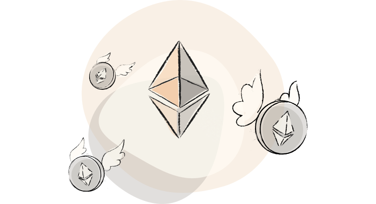

# Hermez docs

> Hermez is currently under development. Some of the details in the documentation can be modified before network launch.

Wellcome to the [Hermez](https://hermez.io) documentation.

Hermez is a zk-rollup, powered by iden3, focused on scaling payments and token transfers on top of Ethereum.

It's designed with high-frequency tokens like ETH, DAI, Tether, and wBTC in mind.
