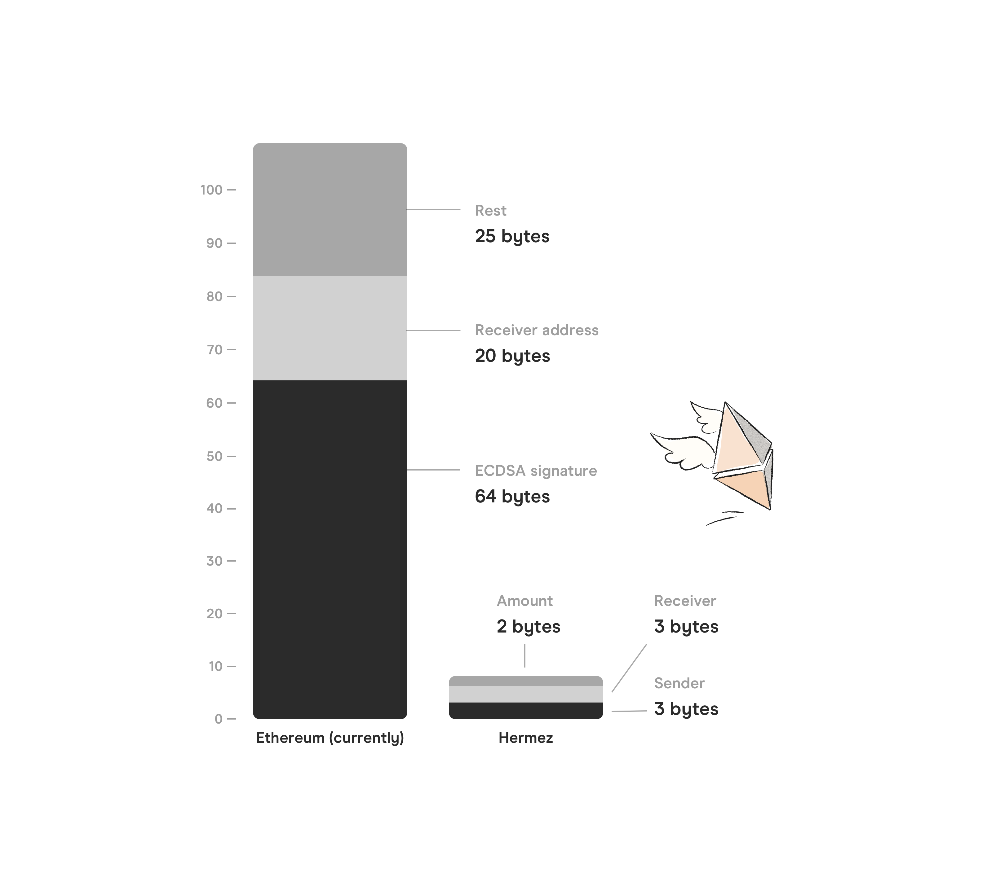

# Ethereum Scalability and zk-Rollups

## Background
During the last year, it has become clear that rollups will be the dominant scaling paradigm on the Ethereum public blockchain: with this in mind, iden3 has developed and is preparing to launch Hermez, a **zk-rollup** focused on scaling payments and token transfers on Ethereum.

Why focusing on transfers? It turns out that more than 50% of transactions on the Ethereum network are transfers, and a large percent of these are deposits and withdrawals from exchanges. Demand could be reduced by a significant amount if exchanges started using rollups, or (in the ideal case) even agreed to meet on the same rollup.

In addition to significantly reducing transaction costs for users, this could have the added benefit of greatly reducing gas prices, and freeing up the base chain for more complex contracts.

## Zero-knowledge Rollups

A zk-rollup, such as Hermez, is a layer 2 construction which uses the Ethereum blockchain for data storage instead of computation:
- All funds are held by a smart contract on the main-chain.

- For every batch of transactions, a zk-SNARK cryptographic proof is generated off-chain.

- This zk-SNARK proves the validity of every transaction in the batch which means it is not necessary to rely on the Ethereum main-chain to verify each signature transaction.

The significance of this is that it allows verification to be carried out in constant time regardless of the number of transactions. **This ability to verify proofs both efficiently and in constant time is at the heart of all zk-rollups**.

In addition to this, all transaction data is published cheaply on-chain, without signatures — under call data. Since the data is published on-chain, there are no data availability problems that have plagued other L2 solutions such as Plasma.

Anyone can reconstruct the current state and history from this on- chain data. This prevents censorship and avoids the centralization of coordinators (rollup batch producers) — since anyone can build the state tree from scratch (and therefore become a coordinator).

### **Why the need for zk-rollups?**

Trust-minimised blockchain scaling mechanisms are sorely needed if blockchain applications are ever to achieve mass adoption.

For context, the Ethereum network can handle approximately 15 transactions per second (tps), while the Visa network averages around 2,000 tps.
This limitation in throughput directly affects the price paid for each transaction and constraints its adoption.

As outlined in an earlier Iden3 [post](https://iden3.io/post/istanbul-zkrollup-ethereum-throughput-limits-analysis), zk-rollups have the potential to increase
the Ethereum network’s maximum tps by two orders of magnitude, making it comparable to the Visa network’s average.

### **How is 2000 tps possible?**

Blockchain scalability is improved by compressing each transaction to ~10 bytes: instead of including signatures on-chain, we send a zk-SNARK which proves that 1000’s of signature verifications and other transaction validation checks have been correctly carried out off-chain.

Since signatures make up a large percentage of transaction costs (gas), in practice zk-rollup has the effect of significantly reducing the average cost per transaction. This allows Hermez to fit more transactions per batch, which results in a greater overall throughput.

> Bytes breakdown: vanilla Eth transaction (109+ bytes) vs zk-rollup transaction (8 bytes)
