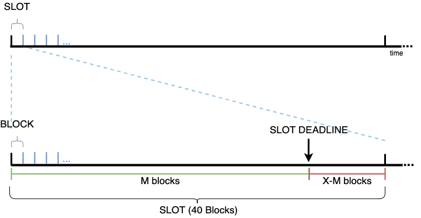
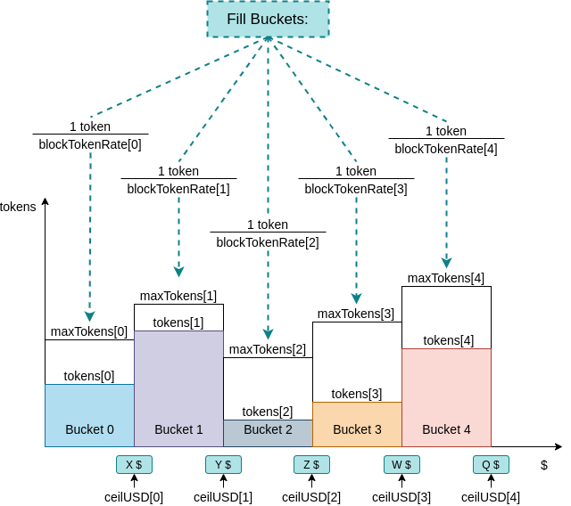

# Developer Guide

This document is an overview of the Hermez protocol. Its objective is to provide an introduction to developers on the Hermez protocol so that the use of tools to interact with Hermez network, such as [`HermezJS`](../developers/sdk?id=sdk) (javascript SDK) and the [`REST API`](../developers/api?id=api), becomes simpler.  This document assumes you are familiar with Ethereum ecosystem and L2 Rollups (in particular zk-rollups).

## Overview
Hermez is a [`zk-rollup`](../developers/glossary?id=zk-rollup) solution that allows scaling payments and token transfers on top of the Ethereum public blockchain. It uses Ethereum for data storage but not for computation. In addition, by using zero-knowledge proofs, it is easy to verify on-chain that computations have been carried out correctly.

All accounts and balances in Hermez network are stored off-chain in a [`state tree`](../developers/glossary?id=state-tree). Incoming user [`transactions`](../developers/glossary?id=transactions) are [`batched`](../developers/glossary?id=batch) together, and through a [`zk-SNARK`](../developers/glossary?id=zk-snark) that proves that those transactions meet certain rules specified in a smart contract, the state tree transitions to a new verifiable valid state.

The [`coordinator`](../developers/glossary?id=coordinator) is the entity that collects and codifies these transactions, calculates the zk-SNARK proof and submits the result to the smart contract that validates the transition. Transactions are made public to provide [`data availability`](../developers/glossary?id=data-availability) to the protocol so that anyone can rebuild the state tree from on-chain data.

Users typically send transactions to Hermez via a wallet. The purpose of this tool is to improve the experience of using Hermez by hiding the internal interactions between the different Hermez components and simplifying the usage. 

The [`governance`](../developers/glossary?id=governance) is the  entity that oversees the sustainability and evolution of the network. Some functions delegated to the governance include the upgrade of smart contracts, the modification of [`system parameters`](../developers/glossary?id=system-parameters), or the execution of the [`withdrawal delay`](../developers/dev-guide?id=withdrawal) mechanism among others.

Hermez deploys three main smart contracts:
1. **Hermez smart contract**: Manages the [`forging`](../developers/glossary?id=forging) stage by checking the zk-proofs provided by the selected coordinator, and updates the state and exit trees. It also interacts with users by collecting L1 transactions and adding them to the transaction pool.
2. **Consensus smart contract**: Manages the selection of a coordinator node via an auction process.
3. **WithdrawalDelayer smart contract**: Manages a withdrawal protection mechanism embedded into the system.

The overall picture of Hermez can be seen in the diagram below.

Users send L1 transactions (such as Create account, Deposit or Withdrawal requests) using a UI. These transactions are collected by the Hermez smart contract and added into a pool of pending transactions.  Users may also send L2 transactions (Transfer, Exit) directly to the coordinator node. The UI hides all the unnecessary complexities from the user, who just selects the type of operation and the input data for a given operation (source account, destination account, amount to transfer,...).
At the time of processing a batch, the coordinator takes the pending L1 transactions from the Hermez smart contract and the received L2 transactions, and generates a proof showing that these transactions have been carried out correctly. This proof is given to the smart contract that verifies it and updates the state of the network.  In the meantime, an auction process is ongoing to select the coordinator node for a given amount of time. In this acution, nodes bid for the right to forge upcoming batches and thus collecting the fees associated to those transactions. The proceedings of these bids will be sent to different accounts, including a  Gitcoin grants account.

Hermez functionalities can be summarized in 4 major groups:
1. Handling L1-user and L2-user transactions
2. Forging batches
3. Reaching [`consensus`](../developers/glossary?id=auction) to select a coordinator
4. Withdrawal of funds.

## Accounts
Hermez stores accounts as leaves in the Hermez state tree. Each account stores a single type of token. A user may own multiple rollup accounts.

There are two types of accounts to operate in Hermez network:
1. **Regular**: Regular accounts can be used in both L1 and L2 transactions. Regular accounts include an ethereum and a [`babyjubjub`](../developers/glossary?id=BabyJubJub) public key. Ethereum key is used to authorize L1 transactions and the babyjubjub key is used to authorize L2 transactions. An ethereum address may authorize the creation of a Regular account containing that same ethereum address plus a babyjubjub public key. Typically, this is done via a UI.

2. **Internal**: Internal accounts only have a babyjubjub key, and thus may only be used in L2 transactions. Since there is no ethereum address, the account creation does not require an authorization and will only require a babyjubjub key.

## Transactions

There are two types of Hermez transactions:
- **L1 transactions** are those that are executed through the smart contract and affect the L2 state tree. These transactions may be started by the user or by the coordinator.
- **L2 transactions** are those that are executed exclusively on L2 and affect the L2 state tree.

### L1 Transactions
L1 transactions can be divided in two groups depending the originator of the transaction:
- **L1 User Transactions**: originate from an Hermez end-user using some form of UI. 
- **L1 Coordinator Transactions**: originate from the coordinator.

#### L1 User Transactions
L1 user transactions are received by the smart contract. These transactions are concatenated to [`force the coordinator`](../developers/dev-guide?id=L1L2-Batches) to process them toguether as part of the same batch. These transactions have to comply with certain rules to be deemed valid by the coordinator. If any of those rules is not fulfilled the transaction will be considered as a NULL transaction.

When coordinator processes L1 transactions, it must process all of them at once (up to a maximum number specified by the smart contract). This rule has two effects:
- Coordinator cannot block particular users in L1.
- Coordinator cannot anticipate the computation of L1 transactions proofs because it needs to take all pending transactions up to the moment of forging (moment when smart contract is called). This means that the coordinator needs to provision certain computation power to ensure idle time is minimized.

Examples of L1 User transactions include `CreateAccountDeposit`, `Deposit`, `DepositTransfer`... All the transactions details are handled by the UI.

#### L1 Coordinator Transactions
L1 Coordinator Transactions allow the cordinator to create internal [`accounts`](../developers/dev-guide?id=accounts) when forging a batch so that a user can transfer funds to another user that doesn't own an account yet.

### L2 Transactions
L2 transactions are exectuted exclusively on L2. Examples of L2 transactions include `Transfer` of funds between rollup accounts or `Exit` to transfer funds to the exit tree. All L2 transactions are initiated by the user, who sends the transactions directly to the coordinator via a [`REST API`](../developers/api?id=api). Depending on the UI capabilities, the user may be able to select among different number of coordinators (the one currently forging, the ones that already have won the right to forge in upcoming slots,...).

Fees are payed on L2 transactions in the same token used in the transaction. The coordinator collects these fees from up to 64 different tokens per batch. If more than 64 tokens are used in the same batch, no fees will be collected for the excess number of tokens. 

## Forging
In this section we will describe how consensus to select a coordinator with the permission to forge batches and collect fees from the processed transactions is reached. We will also describe some of the embedded security mechanisms that discourage these coordinators from acting maliciously.

### Consensus

In Hermez zkRollup, time is divided into slots of a certain duration:
  - Block ethereum = ~ 15s.
  - Slot = 40 Ethereum Blocks ~ 10 min.

Hermez reaches a consensus on who will play the role of coordinator by running an auction managed by a smart contract. This auction is held among the existing nodes for every slot. The node that places the highest bid for a given slot while the auction is open will claim the role of coordinator for that slot. 

The coordinator node is allowed to forge batches during the awarded slot, which is the mechanism by which an authorized coordinator processes a batch of transactions, produces a zk-SNARK attesting to the correctness of the operation and is able to reclaim the processing fees.

Auction bids are placed only in [`HEZ`](../developers/glossary?id=hez). The auction of future slots opens up to **S1** slots in advance. Auction closes **S2** slots before the beginning the slot. Tentative **S1** and **S2** values are 1 month and 2 slots respectively. Additionally, these parameters can be changed by governance at any time.

Bids placed during the auction should be at least greater than the minimal bidding price if it's the first bid in a slot, or a premium bid factor **P** % higher than the previous bid. Both the minimum bidding price and the premium bid factor(**P**) can be modified by the network governance. Tentative values for minimum bid and premium factor are 10 HEZ and 10% respectively. Bids not meeting these conditions will not be valid and bidders will receive their HEZ when the slot is forged.

#### Allocation of Bids
All bids are deposited in the consensus smart contract the moment they are placed. 

Once the slot is forged, the tokens bid are assigned to three different accounts:
- Part will be **burnt**. 
- Part will be assigned to a **donations account** with Gitcoin grants, which will decide how to allocate this funds into different projects.
- Remaining tokens will be allocated to an **incentives account**, compensationg active engagement and network adoption.

### Protection Mechanisms

There are some rules on how coordinators must process transactions. These rules ensure that a coordinator will behave correctly and efficiently, attemptting to forge as many transactions as possible during its allocated slots. 

#### L1/L2 Batches
There are 2 types of batches:
- **L2-batch**: Only L2 transactions are mined.
- **L1L2-batch**: Both L1 and L2 transactions can be mined. In these batches, the coordinator must forge all pending L1 user transactions. Optionally the coordinator may include L1-coordinator-transactions.

Apart from the fact that the coordinator is only able to claim fees for those transactions that are correctly processed, a coordinator is required to process L1 user transactions periodically.  The smart contract establishes a deadline for the L1L2-batches. This deadline indicates the maximum time between two consecutive L1L2 batches. Once this deadline is reached, the coordinator cannot forge any L2 transactions until the deadline is reset which only happens after a L1L2 batch is forged.

This mechanism is summarized in the diagram below.

#### Coordinator Override
If for some reason the coordinator of the current slot doesn't forge any batch in the N first available blocks inside the slot, any available coordinator may forge batches without bidding. These maximum idle time is called **Slot deadline**, and defines the amount of time that any coordinator must wait to start forging without bidding, provided that the coordinator that won the current slot action hasn't forged anything during that time.

This mechanism ensures that as long as there is one honest working coordinator, Hermez network will be running and all funds will be recoverable. 

#### Boot Coordinator
Hermez includes the role of Boot coordinator managed by the network. The Boot coordinator acts as the last resort coordinator and its mission is to guarantee that there is always coordinator available.

#### Slot Grouping
Auction is structured in groups of **6 slots** (i.e, slots are sequentially indexed 0,1,2,3,4,5,0,1,...). Each slot index has an independent minimum bidding price. This grouping allows certain flexibility to the governance to influence behavior of coordinators. If slots are frequently wasted (meaning that elected coordinators chose not to forge batches), governance may increase the minimum bid amount for certain slots to make slot wasting less efficient for coordinators, and thus allowing the boot coordinator to forge the batches.

When the minimum bidding price is set to **0 HEZ value** for a given slot index, the value will be locked and governance will not be able to modify it anymore for that slot. 

## Withdrawal
Funds are recovered from Hermez network by executing two transactions back-to-back:
1. **Exit transaction**: Funds are transferred from Hermez network to a smart contract account.
2. **Withdrawal**: Funds are transferred from smart contract to ethereum address. The limit and rate at which funds can be transferred from the smart contract is regulated by a [`leaky bucket`](https://en.wikipedia.org/wiki/Leaky_bucket) algorithm. Depending on the amount of available credits in the smart contract, withdrawal may be instantaneous or delayed.

### Hermez Withdrawal Limit
Withdrawals are classified in one of several buckets depending on the USD amount to be withdrawn. Every bucket contains some amount of credits indicating the maximum amount that can be withdrawn at any point in time. Buckets are re-filled with credits at a specifc rate (depending on bucket). When a user attempts to withdraw funds, credits in the selected bucket are substracted. If the withdrawal amount exceeds the existing value of credits, the instant withdrawal cannot be performed and a delayed withdrawal will be done instead. Delayed withdrawal is handled by the WithdrawalDelayer smart contract.

Figure below depicts how the different buckets are structured depending on the amount.

### Withdrawal Resolution
The amount above the `withdrawal limit` set by the available credits wont be withdrawn instantly. In this case, excess tokens will be sent to the `WithdrawalDelayer` smart contract. 

The WithdrawalDelayer smart contract can be in one of two states:
1. **Normal Mode**: Amount above withdrawal limit is available for withdrawal, but with a delay D. This is the standard state.
2. **Emergency Mode**: If governance detects an attack, the WithdrawalDelayer mode is changed to Emergency Mode. In this scenario, funds can only be withdrawn by governance, and if governance doesn't recover the funds in a given period, then funds can be withdrawn by a white hack group.

## Adding New Tokens
Hermez contains a list with all tokens supported. The following list includes some requirements on the token listing:
- Tokens must be ERC20
- Only the governance can add new tokens.
- There can be up to 2^{32} different tokens.
- Contracts maintain a list of all tokens registered in the rollup and each token needs to be listed before using it.
- There cannot be two tokens with the same ethereum address.

The list of supported tokens can be retrieved though the [`REST API`](../developers/api?=api) 
