# Hermez Wallet

## What is Hermez Wallet

Hermez Wallet provides a simple UI to get started with the Hermez network. It supports depositing, transferring and withdrawing ETH and ERC-20 tokens in Hermez. Wallet provides a simple UI to get started.

## Onboarding

When opening the wallet, there's a button to log in with Metamask. This will automatically derive a Hermez account from the Ethereum account.

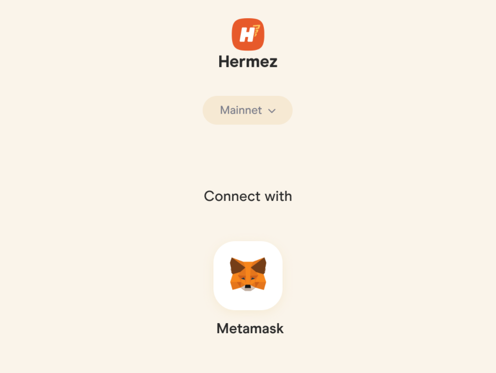

This will then lead to an empty wallet:

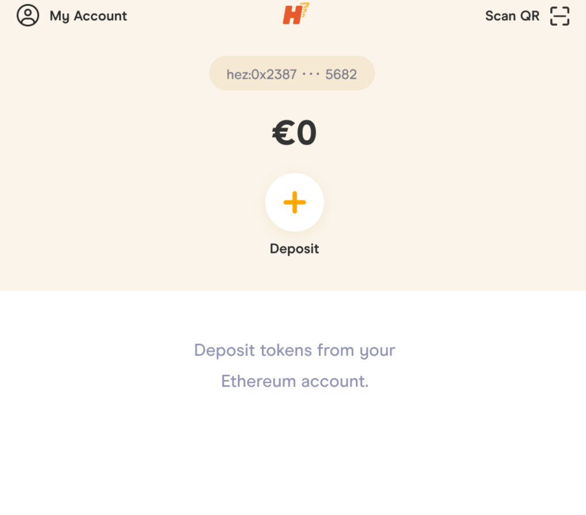

The next step is to make a deposit

## Transactions

There are 3 kinds of transactions:

- Deposits. Sends ETH or an ERC-20 token (must be registered in Hermez) from your Ethereum account to your Hermez account.
- Transfers. Sends ETH or an ERC-20 token from a Hermez account to another Hermez account.
- Withdraws. Sends ETH or an ERC-20 token rom a Hermez account to its corresponding Ethereum account.

They all follow a similar flow. First, we select a token. If it's a `Deposit`, the token must be in the Ethereum account. Otherwise, it must be in the Hermez account.

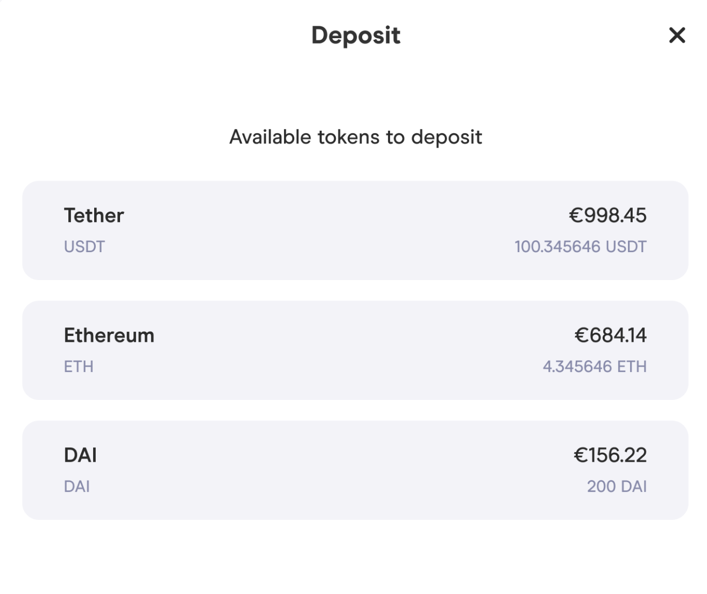

Then there's a form to select the amount:

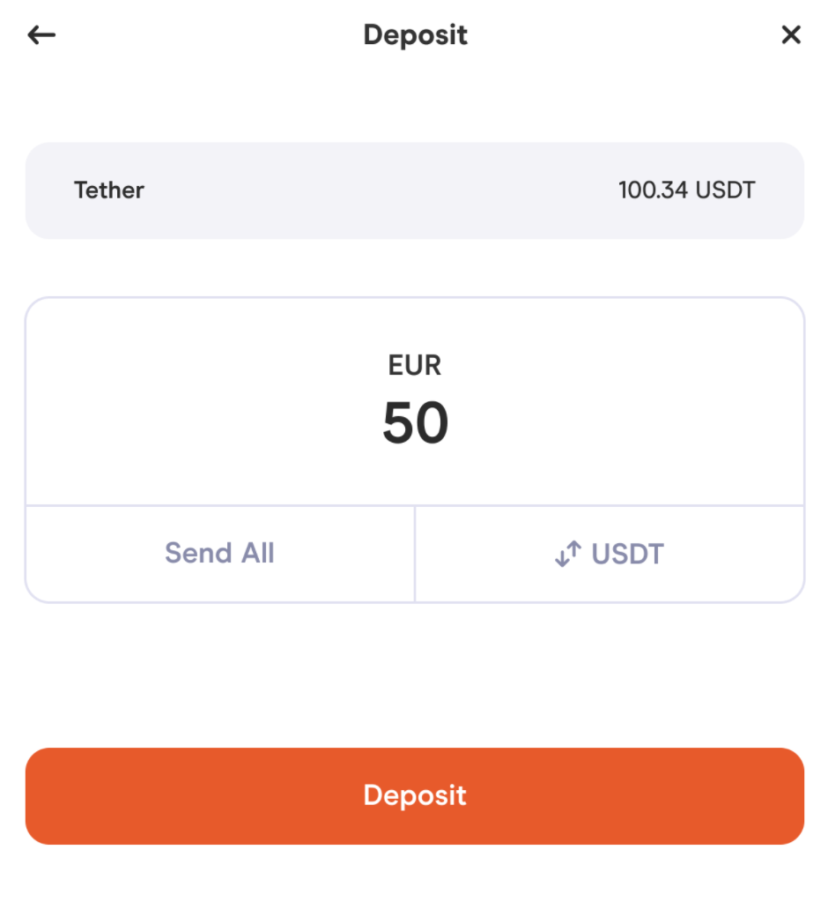

In the case of a `Transfer`, there will also be a **receiver** input. This input also supports scanning a QR code or pasting the Receiver's address directly.

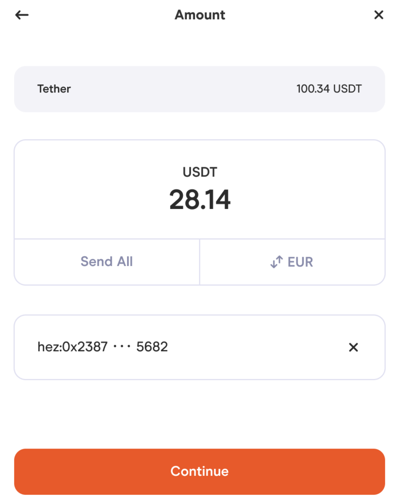

If everything is valid, the next step is the confirmation with a look of all the transaction parameters. If it's a `Deposit`, as it is a Layer 1 transaction, it will require signing with your Ethereum Wallet (e.g. Metamask).

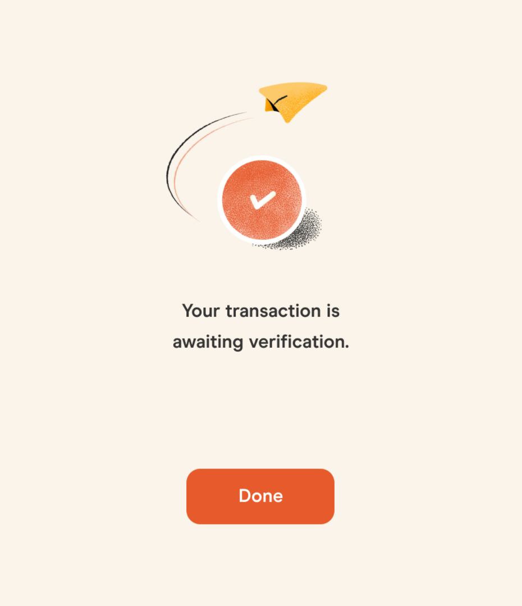

This leads to the confirmation screen if everything went well:

## Accounts

Making `Deposits` creates accounts that now appear in the home screen.

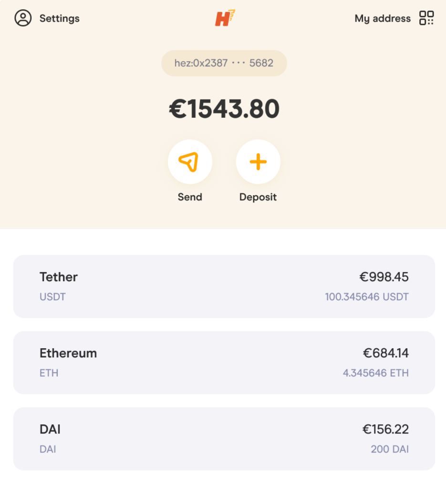

Opening an account shows all the transactions related to that account.

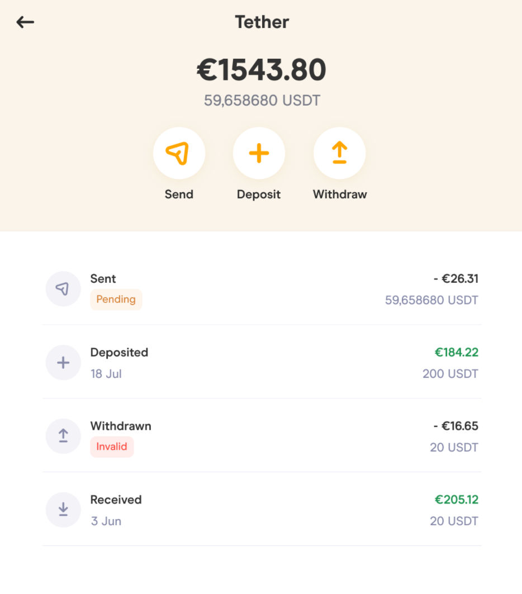

Opening a transaction shows information related to that transaction. There's also a button to open the Batch Explorer with all the information.

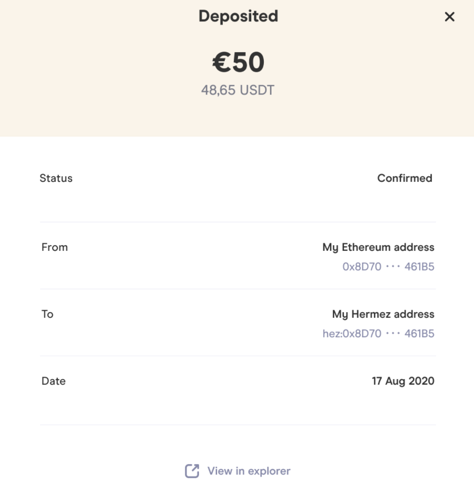

## Withdrawals

Withdrawals are a two-part process. After completing the first part explained above, a card appears on the Home screen or on the respective account page. When ready, it will show a button to finalise the withdrawal.

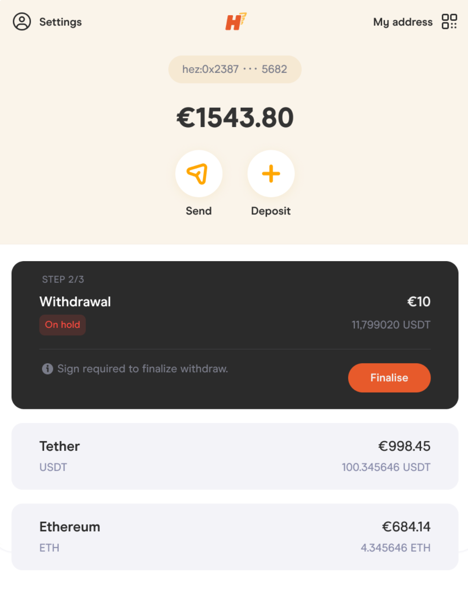

## My Account

There's a My Account page. Current options are:

- Copying your Hermez Address or displaying it as a QR code.
- Changing the default FIAT currency between EUR and USD.
- Making a `Force Withdrawal`. This is a L1 equivalent of the first step of the withdrawal as explained above. This uses more Gas but forces the Coordinator to pick the transaction up. It's only a security measure and shouldn't be needed.
- View the Hermez account in the Batch Explorer.
- Logging out.

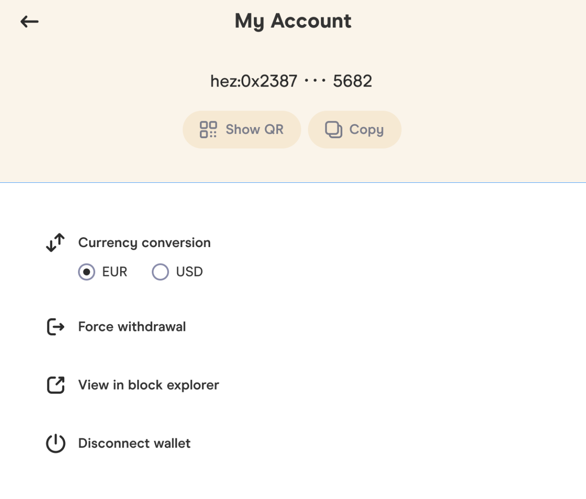