# Circuits

## Overview

All rules a transaction must follow in order to be valid are designed and coded in the circuits. Those rules could be seen as constraints that a transaction must accomplish in order to be able to modify the state tree or the exit tree.

Circuits are built from the bottom up. Hence, small circuits are first introduced and are referenced in advanced ones for the sake of clarity.

Circuits would be splitted in three modules:
- library: basic hermez circuits and structs commonly used across the rest of the circuits
- withdraw: specifc circuit to allow a user to withdraw funds from hermez contract
- rollup-main: main circuit that contains all the logic described in [zkRollup protocol](developers/protocol/hermez-protocol/protocol)

> withdraw: user could perform a withdrawal by submitting a zkProof or a merkle tree proof. Boths methods are equivalent in terms of functionality. 

- Global variables:
  - `nTx`: absolute maximum of L1 or L2 transactions allowed
  - `nLevels`: merkle tree depth
  - `maxL1Tx`: absolute maximum of L1 transaction allowed
  - `maxFeeTx`: absolute maximum of fee transactions allowed

### circuit organization
- Library:
  - [hash-state](developers/protocol/hermez-protocol/circuits/circuits?id=hash-state) 
  - [decode-float](developers/protocol/hermez-protocol/circuits/circuits?id=decode-float)
  - [mux256](developers/protocol/hermez-protocol/circuits/circuits?id=mux256)
  - [utils-bjj](developers/protocol/hermez-protocol/circuits/circuits?id=utils-bjj)
- Source:
  - [decode-tx](developers/protocol/hermez-protocol/circuits/circuits?id=decode-tx)
  - [fee-accumulator](developers/protocol/hermez-protocol/circuits/circuits?id=fee-accumulator)
  - [rq-tx-verifier](developers/protocol/hermez-protocol/circuits/circuits?id=rq-tx-verifier)
  - [hash-inputs](developers/protocol/hermez-protocol/circuits/circuits?id=hash-inputs)
  - [fee-tx](developers/protocol/hermez-protocol/circuits/circuits?id=fee-tx)
  - [compute-fee](developers/protocol/hermez-protocol/circuits/circuits?id=compute-fee)
  - [balance-updater](developers/protocol/hermez-protocol/circuits/circuits?id=balance-updater)
  - [rollup-tx-states](developers/protocol/hermez-protocol/circuits/circuits?id=rollup-tx-states)
  - [rollup-tx](developers/protocol/hermez-protocol/circuits/circuits?id=rollup-tx)
  - [rollup-main](developers/protocol/hermez-protocol/circuits/circuits?id=rollup-main)
- [withdraw](developers/protocol/hermez-protocol/circuits/circuits?id=withdraw) 

#### Dependencies
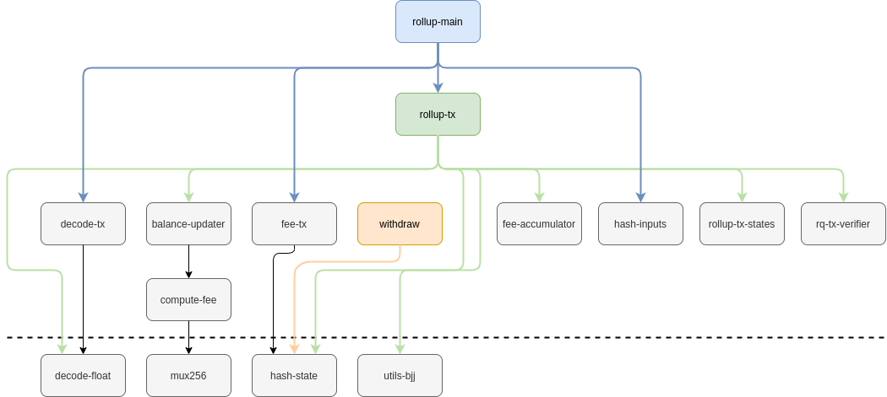

## Assumptions
### L1 transactions
Some assumptions has to take into account in L1 transactions. Those are performed by users which interact with the smart contract. Hence, smart contract perform checks and force some parameters that are assumed in the circuit implementation:
- `tokenID` must exist
- `loadAmount` < 2^128
- `amount` < 2^192
- if `toIdx == 0` then `amount == 0`
- if `fromIdx == 0` then `fromBjj-compressed != 0`
- if `fromIdx > INITIAL_IDX` then `fromBjj-compressed == 0`

A summary is shown in the next table with all the L1 transactions assumptions:
- `UP`: user parameter
- `ME`: must exist

|     **Transaction type**     | toIdx  | tokenID |  amountF   | loadAmountF | fromIdx | fromBjj-compressed | fromEthAddr |
|:----------------------------:|:------:|:-------:|:----------:|:-----------:|:-------:|:------------------:|:-----------:|
|        createAccount         |   0    | UP, ME  |     0      |      0      |    0    |      UP (!=0)      | msg.sender  |
|     createAccountDeposit     |   0    | UP, ME  |     0      | UP < 2^128  |    0    |      UP (!=0)      | msg.sender  |
| createAccountDepositTransfer | UP, ME | UP, ME  | UP < 2^192 | UP < 2^128  |    0    |      UP (!=0)      | msg.sender  |
|           deposit            |   0    | UP, ME  |     0      | UP < 2^128  | UP, ME  |         0          | msg.sender  |
|       depositTransfer        | UP, ME | UP, ME  | UP < 2^192 | UP < 2^128  | UP, ME  |         0          | msg.sender  |
|        forceTransfer         | UP, ME | UP, ME  | UP < 2^192 |      0      | UP, ME  |         0          | msg.sender  |
|          forceExit           |   1    | UP, ME  | UP < 2^192 |      0      | UP, ME  |         0          | msg.sender  |

>All L1 transactions are further explained [here](developers/protocol/hermez-protocol/protocol?id=l1-user-transactions)

## Legend

It should be note that `public` and `private` signals will be highlighted only in top layer circuits:
- [withdraw](developers/protocol/hermez-protocol/circuits/circuits?id=withdraw)
- [rollup-main](developers/protocol/hermez-protocol/circuits/circuits?id=rollup-main)

## Library

### hash-state
#### Description
Gets the inputs of the state and computes its hash as described [here](developers/protocol/hermez-protocol/protocol?id=state-tree)

#### Schematic
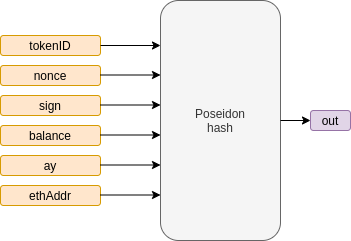

#### Inputs
|  Input  |  type   |       Description       |
|:-------:|:-------:|:-----------------------:|
| tokenID | uint32  |    token identifier     |
|  nonce  | uint40  |          nonce          |
|  sign   | boolean |     babyjubjub sign     |
| balance | uint192 |    amount available     |
|   ay    |  field  | babyjubjub y coordinate |
| ethAddr | uint160 |    ethereum address     |

#### Outputs
| Output | type  | Description |
|:------:|:-----:|:-----------:|
|  out   | field | state hash  |

### decode-float
#### Description
Gets an input representing a `float16` format and decode it to a large integer value as described [here](developers/protocol/hermez-protocol/protocol?id=floating-point-format-float16)

- Steps:
  - get the 16 less significant bits
  - compute exponent
  - compute half exponent flag
  - compute mantissa
  - compute final large integer 

#### Schematic

#### Inputs
| Input |  type  |  Description   |
|:-----:|:------:|:--------------:|
|  in   | uint16 | float16 encode |

#### Outputs
| Output | type  |  Description   |
|:------:|:-----:|:--------------:|
|  out   | field | float16 decode |

### mux256
#### Description
Multiplexer with 256 inputs

#### Schematic

#### Inputs
|  Input  |     type      |  Description  |
|:-------:|:-------------:|:-------------:|
|  s[8]   | boolean array | mux selectors |
| in[256] |  field array  |  mux inputs   |

#### Outputs
| Output | type  |  Description   |
|:------:|:-----:|:--------------:|
|  out   | field | selected input |

### utils-bjj
#### Description
Implements two functionalities to be used for further circuits:

- BitsCompressed2AySign
  - gets the `bjjCompressed[256]` in bits and retrieve `ay` and `sign` to be inserted into the account state
- AySign2Ax
  - gets the `ay` and `sign` and computes de `ax` coordinate

#### Schematic
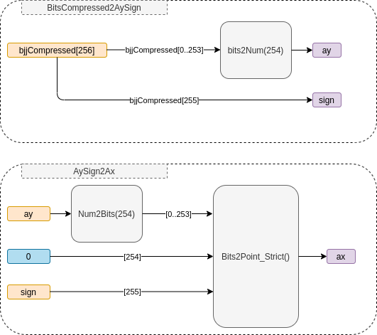

#### Input
- BitsCompressed2AySign

|       Input        |     type      |         Description         |
|:------------------:|:-------------:|:---------------------------:|
| bjjCompressed[256] | boolean array | babyjubjub point compressed |

- AySign2Ax

| Input |  type   |       Description       |
|:-----:|:-------:|:-----------------------:|
|  ay   |  field  | babyjubjub y coordinate |
| sign  | boolean |     babyjubjub sign     |

#### Ouput
- BitsCompressed2AySign

| Output |  type   |       Description       |
|:------:|:-------:|:-----------------------:|
|   ay   |  field  | babyjubjub y coordinate |
|  sign  | boolean |     babyjubjub sign     |

- AySign2Ax

| Output | type  |       Description       |
|:------:|:-----:|:-----------------------:|
|   ax   | field | babyjubjub x coordinate |

## Source

### decode-tx
#### Description
Take the transaction data, decodes it and build data structures to be used in further circuits. Besides, it does checks on transactions fields. It is listed below all the built data and all the checks that this circuit performs.

- Decoders/Build
  - decodes `txCompressedData` as specified [here](developers/protocol/hermez-protocol/protocol?id=l2)
  - builds `txCompressedDataV2` as specified [here](developers/protocol/hermez-protocol/protocol?id=l2)
  - builds L2 data availability `L2TxData` as specificied [here](developers/protocol/hermez-protocol/protocol?id=l2-transactions)
  - builds message to sign by L2 transactions `sigL2Hash` as specified [here](developers/protocol/hermez-protocol/protocol?id=l2)
  - build L1 data `L1TxData` as specified [here](developers/protocol/hermez-protocol/protocol?id=l1-user-transactions)
- Checks
  - L1 transactions must be processed before L2 transactions
    - only switching from L1 to L2 is allowed
  - checks `newAccount` is set to true only when it is an L1 transaction and `fromIdx` is 0  
  - `idx` to be assigned to a new account creation is incremented and checked only if the transaction involves an account creation
  - checks `chainID` transaction field matches `globalChainID` forced by the smart contract
  - checks `signatureConstant` transaction field matches the hardcoded value `CONST_SIG` set in the circuit     
- Global variables:
  - `nLevels`

#### Schematic
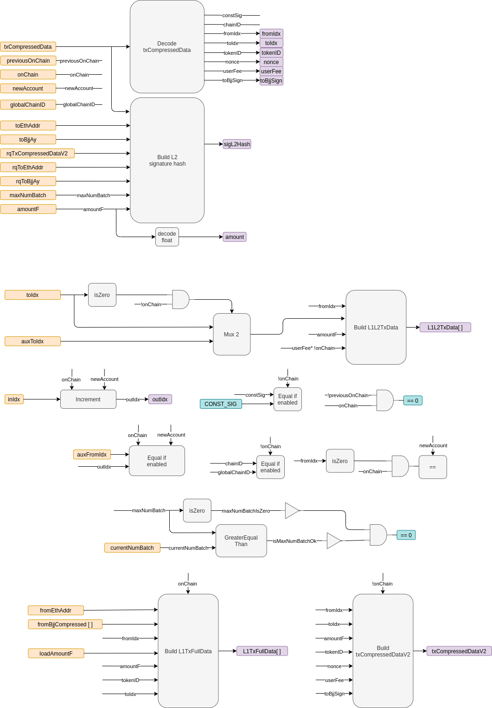

#### Inputs
|         Input          |     type      |                      Description                       |
|:----------------------:|:-------------:|:------------------------------------------------------:|
|    previousOnChain     |     bool      |        dtermines if previous transaction is L1         |
|    txCompressedData    |    uint241    |           encode transaction fields together           |
|       toEthAddr        |    uint160    |               ethereum address receiver                |
|        toBjjAy         |     field     |            bayjubjub y coordinate receiver             |
|  rqTxCompressedDataV2  |    uint193    | requested encode transaction fields together version 2 |
|      rqToEthAddr       |    uint160    |          requested ethereum address receiver           |
|       rqToBjjAy        |     field     |           requested babyjubjub y coordinate            |
|      fromEthAddr       |    uint160    |                ethereum address sender                 |
| fromBjjCompressed[256] | boolean array |              babyjubjub compressed sender              |
|      loadAmountF       |    uint16     |   amount to deposit from L1 to L2 encoded as float16   |
|     globalChainID      |    uint16     |                global chain identifier                 |
|        onChain         |     bool      |        determines if the transacion is L1 or L2        |
|       newAccount       |     bool      |    determines if transaction creates a new account     |
|       auxFromIdx       |    uint48     |           auxiliary index to create accounts           |
|         inIdx          |    uint48     |                old last index assigned                 |

#### Outputs
|       Output       |     type      |                 Description                  |
|:------------------:|:-------------:|:--------------------------------------------:|
|      L2TxData      | array boolean |             L2 data availability             |
| txCompressedDataV2 |    uint193    | encode transaction fields together version 2 |
|      L1TxData      | array boolean |                   L1 data                    |
|       outIdx       |    uint48     |           old last index assigned            |
|      fromIdx       |    uint48     |                 index sender                 |
|       toIdx        |    uint48     |                index receiver                |
|       amount       |    uint192    |       amount to transfer from L2 to L2       |
|      tokenID       |    uint32     |               token identifier               |
|       nonce        |    uint40     |                    nonce                     |
|      userFee       |     uint8     |              user fee selector               |
|     toBjjSign      |    boolean    |           babyjubjub sign receiver           |
|     sigL2Hash      |     field     |             hash L2 data to sign             |

### fee-accumulator
#### Description
Updates the fees accumulated by each transaction given its fee. 

- Definitions:
  - `tokenID`: token to update
  - `feePlanTokenID[numTokens]`: array of all the tokenID that fees will be accumulated
  - `accFeeIn[numTokens]`: initial array of all fees accumulated
  - `fee2Charge`: effective fee charged in a transaction
  - `accFeeOut[numTokens]`: final array of all fees accumulated
- Steps:
  - find the position on the array `feePlanTokenID[numTokens]` where its element matches the current transaction `tokenID`  
    - if no match found, no fee would be accumuated and `accFeeIn[0..numTokens] == accFeeOut[0..numTokens]`
  - if a match is found:
    - accumulate the fee `fee2Charge` inside its position `i` on `accFeeOut[i]`
    - avoid accumulate fees once the match is found
- Global variables:
  - `maxFeeTx`

#### Schematic
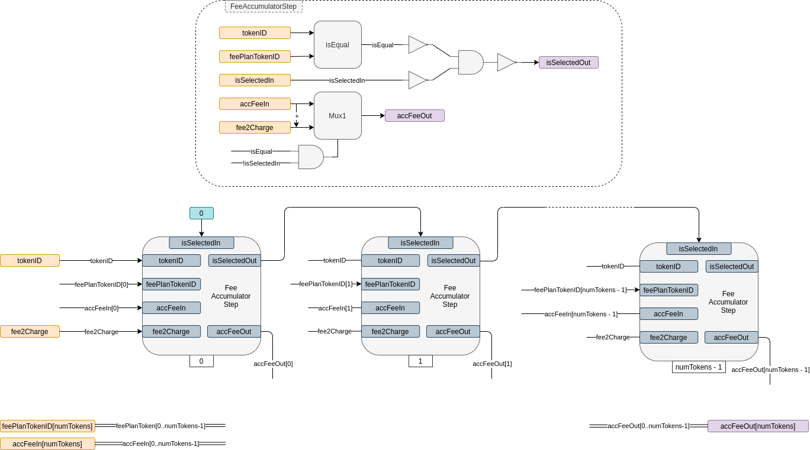

#### Inputs
|          Input           |     type      |              Description               |
|:------------------------:|:-------------:|:--------------------------------------:|
|         tokenID          |    uint32     |          tokenID transaction           |
|        fee2Charge        |    uint192    |              fee charged               |
| feePlanTokenID[maxFeeTx] | uint32 array  | all tokens eligible to accumulate fees |
|    accFeeIn[maxFeeTx]    | uint192 array |        initial fees accumulated        |

#### Outputs
|       Output        |     type      |      Description       |
|:-------------------:|:-------------:|:----------------------:|
| accFeeOut[maxFeeTx] | uint192 array | final fees accumulated |

### rq-tx-verifier
#### Description
Required transaction offset `rqTxOffset` is the relative index of the transaction that would be linked. This implementation adds atomics swaps support since one transaction is linked to another by this relative index meaning that a transaction can only be processed if the linked transaction is processed too.

Next circuit aims to check the past and future data transactions to match the required data signed.

Data to be signed in order to link transactions can be found [here](developers/protocol/hermez-protocol/protocol?id=transaction-fields)

> Note that setting `rqTxOffset` to 0 means that no transaction is linked 

- Steps:
  - get data of future/past transactions
  - get relative index and current required data
  - check required data matched the future/past transaction

#### Schematic
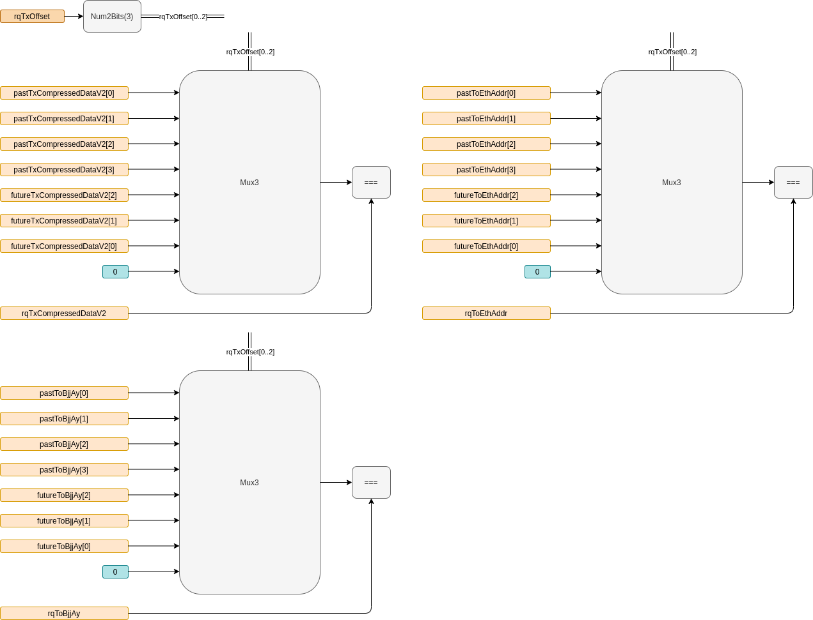

#### Input
|            Input            |     type      |                      Description                       |
|:---------------------------:|:-------------:|:------------------------------------------------------:|
| futureTxCompressedDataV2[3] | uint192 array |         future transactions txCompressedDataV2         |
|  pastTxCompressedDataV2[4]  | uint192 array |          past transactions txCompressedDataV2          |
|     futureToEthAddr[3]      | uint160 array |             future transactions toEthAddr              |
|      pastToEthAddr[4]       | uint160 array |              past transactions toEthAddr               |
|      futureToBjjAy[3]       |  field array  |              future transactions toBjjAy               |
|       pastToBjjAy[4]        |  field array  |               past transactions toBjjAy                |
|    rqTxCompressedDataV2     |    uint192    | requested encode transaction fields together version 2 |
|         rqToEthAddr         |    uint160    |          requested ethereum address receiver           |
|          rqToBjjAy          |     field     |           requested babyjubjub y coordinate            |
|         rqTxOffset          |     uint3     |              relative linked transaction               |

#### Output
None

### hash-inputs
#### Description
Take all the pretended public inputs and hash them all together to build a single public input for the circuit. The pretended public inputs will turn into private inputs of the circuit.

Note that this single input will be built by the smart contract. Therefore, proof must match all the data hashed in the `input hash` which is built inside the circuit from private signals.

> checkout [here](developers/protocol/hermez-protocol/protocol?id=circuit) definition of global settings

Specification for computing `hashInputs` can be found [here](developers/protocol/hermez-protocol/protocol?id=forging)

- Global variables:
  - `nLevels`
  - `nTx`
  - `maxL1Tx`
  - `maxFeeTx`   

#### Schematic
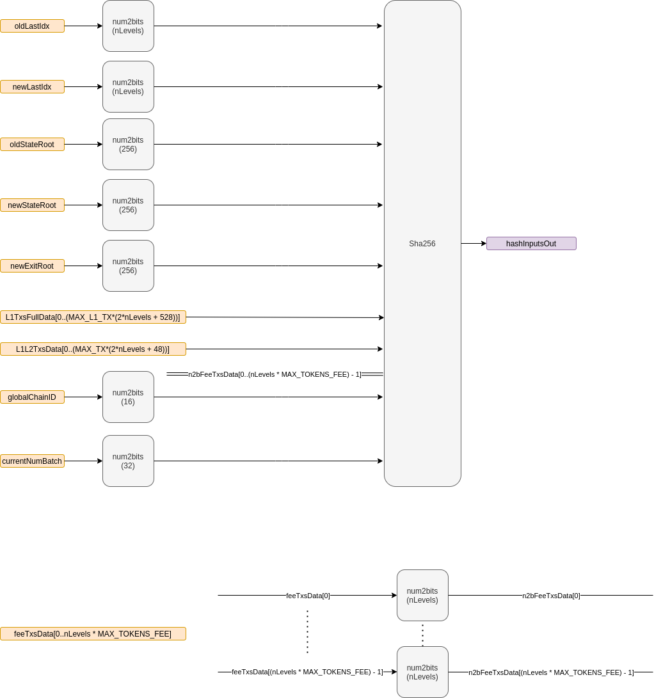

#### Inputs
|                            Input                            |     type      |                   Description                   |
|:-----------------------------------------------------------:|:-------------:|:-----------------------------------------------:|
|                         oldLastIdx                          |    uint48     |       old last merkle tree index created        |
|                         newLastIdx                          |    uint48     |       new last merkle tree index created        |
|                        oldStateRoot                         |     field     |                 old state root                  |
|                        newStateRoot                         |     field     |                 new state root                  |
|                         newExitRoot                         |     field     |                  new exit root                  |
| L1TxsData[maxL1Tx * (2*nLevels + 32 + 16 + 16 + 256 + 160)] | boolean array |                  bits L1 data                   |
|            L2TxsData[nTx * (2*nLevels + 16 + 8)]            | boolean array |      bits L2 transaction data-availability      |
|                    feeTxsData[maxFeeTx]                     | nLevels array | all index accounts to  receive accumulated fees |
|                        globalChainID                        |    uint16     |             global chain identifier             |

#### Ouputs
|    Output     | type  |              Description               |
|:-------------:|:-----:|:--------------------------------------:|
| hashInputsOut | field | sha256 hash of pretended public inputs |

### fee-tx
#### Description
This circuit handles each fee transaction. Fee transaction takes the accumulate fees for a given `tokenID` and updates the recipient where the fees are wanted to be paid. It checks account existence with the old state root, process the account update and compute the new state root.

`TokenID` must match between fee accumulated and recipient account in order to not update wrong recipients.

Besides, if coordinator does not fulfill all the possible recipient to receive fees, fee transaction could be a NOP transaction by setting the recipient to the null index (`IDX 0`)

- Steps:
  - check if `idxFee` is zero
  - `NOP` transaction if `idxFee` is zero. Otherwise:
    - check match `planTokenID` and `tokenID` for updating the state
    - compute merkle tree processor function (`UPDATE` or `NOP`)
    - compute old state value (old account balance)
    - compute new state value (old account balance + accumulate fee)
    - merkle tree processor to compute account update and get new state root
- Global variables:
  - `nLevels`

#### Schematic
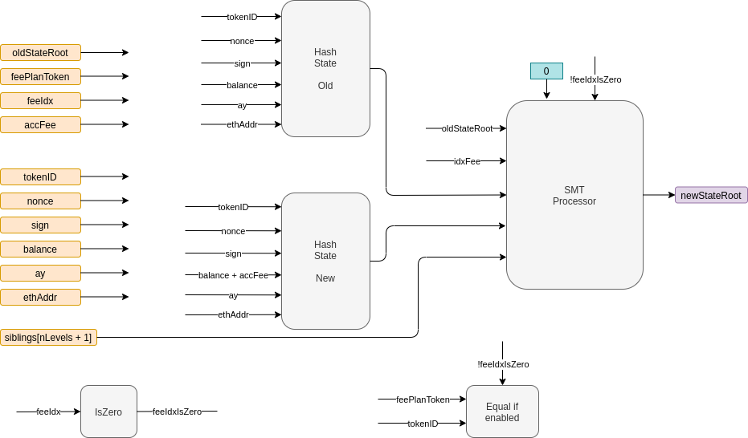

#### Inputs
|         Input         |    type     |             Description              |
|:---------------------:|:-----------:|:------------------------------------:|
|     oldStateRoot      |    field    |            old state root            |
|     feePlanToken      |   uint32    | token identifier of fees accumulated |
|        feeIdx         |   uint48    |  merkle tree index to receive fees   |
|        accFee         |   uint192   |     accumulated fees to transfer     |
|        tokenID        |   uint32    |        tokenID of leaf feeIdx        |
|         nonce         |   uint40    |         nonce of leaf feeIdx         |
|         sign          |    bool     |         sign of leaf feeIdx          |
|        balance        |   uint192   |        balance of leaf feeIdx        |
|          ay           |    field    |          ay of leaf feeIdx           |
|        ethAddr        |   uint160   |        ethAddr of leaf feeIdx        |
| siblings[nLevels + 1] | field array |        siblings merkle proof         |

#### Outputs
|    Output    | type  |  Description   |
|:------------:|:-----:|:--------------:|
| newStateRoot | field | new state root |

### compute-fee
#### Description
Computes the final amount of fee to apply given the fee selector

- Steps:
  - selects fee factor, `feeOut`, to apply given `feeSel` and `applyFee`
  - compute `feeOutNotShifted = amount * feeOut` and convert it into bits in `feeOutBits[253]`
  - compute `applyShift` to decide if shift has to be applied to `feeOutNotShifted`
  - select bits on `feeOutBits[253]` depending on `applyShift` flag
  - assert `feeOut` is $< 2^{128}$

> It should be noted that `feeShiftTable[x]` are values hardcoded in the circuit that will match the [fee factor shifted](developers/protocol/hermez-protocol/fee-table?id=feefactor-left-shifted)

> 60 bits has been chosen in order to optimize precision at the time to compute fees. 60 bits is the minimum bits to achieve enough precision according [fee table values](developers/protocol/hermez-protocol/fee-table?id=transaction-fee-table)

#### Schematic
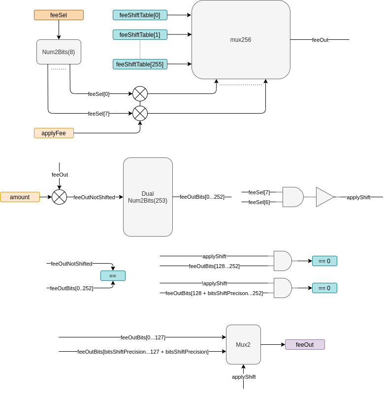

#### Inputs
|  Input   |  type   |                     Description                      |
|:--------:|:-------:|:----------------------------------------------------:|
|  feeSel  |  Uint8  |                     fee selector                     |
|  amount  | Uint128 |            amount to apply the fee factor            |
| applyFee | boolean | determines if fee needs to be computed or if it is 0 |

#### Outputs
| Output |  type   |    Description     |
|:------:|:-------:|:------------------:|
| feeOut | Uint128 | amount * feeFactor |

### balance-updater
#### Description
This circuit checks if there is enough balance in the sender account to do the transfer to the receiver account.

It computes the new balances for the sender and the receiver. Besides, returns the fee that will be charged and if the amount to transfer is 0 (`isP2Nop` signal). These signals will be used in further circuits.

It should be noted that in L1 tx, no errors are allowed but the circuit needs to process them. Hence, in case it is not enough balance on the sender account, it will process the transaction as a 0 amount transfer. In case of an L2 tx, the protocol does not allow to do a transaction if there is not enough balance on the sender account.

- The following assumptions has been taken:
  - smart contract filters `loadAmount` above 2^128
  - smart contract filters `amount` above 2^192
  - circuit reserves 192 bits for the balance of an account
  - overflow applies only if more than 2^64 transactions are done  
  - assume overflow is not feasible
- Steps:
  - compute fee to be applied(`fee2Charge`)
  - compute effective amount (`effectiveAmount1` and `effectiveAmount2`)
  - check underflow (`txOk`)
  - compute new balances from sender and receiver (`newStBalanceSender` and `newStBalanceReceiver`) 

#### Schematic
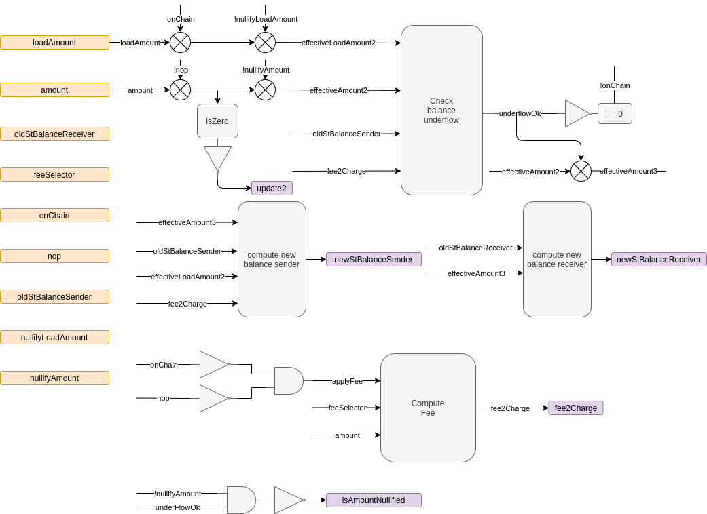

#### Inputs
|        Input         |  type   |                         Description                         |
|:--------------------:|:-------:|:-----------------------------------------------------------:|
|  oldStBalanceSender  |  field  |                   initial sender balance                    |
| oldStBalanceReceiver |  field  |                  initial receiver balance                   |
|        amount        | uint192 |              amount to transfer from L2 to L2               |
|      loadAmount      | uint192 |               amount to deposit from L1 to L2               |
|     feeSelector      |  uint8  |                      user selector fee                      |
|       onChain        |  bool   |          determines if the transacion is L1 or L2           |
|         nop          |  bool   | determines if the transfer amount and fees are considered 0 |
|  nullifyLoadAmount   |  bool   |       determines if loadAmount is considered to be 0        |
|    nullifyAmount     |  bool   |         determines if amount is considered to be 0          |

#### Outputs
|        Output        |  type   |                     Description                      |
|:--------------------:|:-------:|:----------------------------------------------------:|
|  newStBalanceSender  | uint192 |                 final balance sender                 |
| newStBalanceReceiver | uint192 |                final balance receiver                |
|       isP2Nop        |  bool   |   determines if processor 2 performs a NOP function  |
|      fee2Charge      | uint192 |              effective transaction fee               |

### rollup-tx-states
#### Description
This circuit is a subset of the `rollup-tx` circuit. It has been splitted for clarity.

Transaction states are computed depending on transactions type. All transaction types can be found [here](developers/protocol/hermez-protocol/protocol?id=transaction-types)

> Note that L1 coordinator transactions are treated as L1 user `createAccountDeposit` inside the circuit. Circuit does not differentiate transactions taking into account its source, either launched by user o by coordinator.

Sender and receiver accounts have their own merkle tree processors inside the circuit in order to perform actions on their leafs:
  - sender: processor 1
  - receiver: processor 2

The following table summarizes all the processor actions:

| func[0] | func[1] | Function |
|:-------:|:-------:|:--------:|
|    0    |    0    |   NOP    |
|    0    |    1    |  UPDATE  |
|    1    |    0    |  INSERT  |
|    1    |    1    |  DELETE  |

Therefore, given the transaction type, it is needed to specify certain signals that would be used in `rollup-tx` circuit:
  - `isP1Insert`: determines if processor 1 performs an INSERT function (sender) 
  - `isP2Insert`: determines if processor 2 performs an INSERT function (receiver)
  - `key1`: set key to be used in processor 1
  - `key2`: set key to be used in processor 2
  - `P1_fnc0` and `P1_fnc1`: selectors for processor 1
  - `P2_fnc0` and `P2_fnc1`: selectors for processor 2
  - `isExit`: determines if the transaction is an exit type
  - `verifySignEnable`: enable babyjubjub signature checker
  - `nop`: transaction is processed as a NOP transaction
  - `checkToEthAddr`: enable `toEthAddr` check
  - `checkToBjj`: enable `toBjjAy` and `toBjjSign` check

Following truth table determines how to set the above signals depending on transaction inputs:
> Note that italics make reference to outputs, regular makes reference to inputs

|    **Transaction type**     |   fromIdx   | auxFromIdx | toIdx | auxToIdx |       toEthAddr        | onChain | newAccount | loadAmount | amount |       newExit       | *isP1Insert* |         *isP2Insert*         | *processor 1* |    *processor 2*     | *isExit* | *verifySignEnable* | *nop* | *checkToEthAddr* | *checkToBjj* |
|:---------------------------:|:-----------:|:----------:|:-----:|:----------:|:----------------------:|:-------:|:----------:|:----------:|:------:|:--------------------:|:----:|:--------------------:|:-------------:|:--------------------:|:--------:|:------------------:|:-----:|:----------------:|:------------:|
|         createAccount       |      0      |    key1    |   0   |     0      |           0            |    1    |     1      |     0      |   0    |          0           |  1   |          0           |    INSERT     |        UPDATE        |    0     |         0          |   0   |        0         |      0       |
|    createAccountDeposit     |      0      |    key1    |   0   |     0      |           0            |    1    |     1      |     X      |   0    |          0           |  1   |          0           |    INSERT     |        UPDATE        |    0     |         0          |   0   |        0         |      0       |
| createAccountDepositTranfer |      0      |    key1    | key2  |     0      |           0            |    1    |     1      |     X      |   X    |          0           |  1   |          0           |    INSERT     |        UPDATE        |    0     |         0          |   0   |        0         |      0       |
|           deposit           |    key1     |     0      |   0   |     0      |           0            |    1    |     0      |     X      |   0    |          0           |  0   |          0           |    UPDATE     |        UPDATE        |    0     |         0          |   0   |        0         |      0       |
|       depositTransfer       |    key1     |     0      | key2  |     0      |           0            |    1    |     0      |     X      |   X    |          0           |  0   |          0           |    UPDATE     |        UPDATE        |    0     |         0          |   0   |        0         |      0       |
|        forceTransfer        |    key1     |     0      | key2  |     0      |           0            |    1    |     0      |     0      |   X    |          0           |  0   |          0           |    UPDATE     |        UPDATE        |    0     |         0          |   0   |        0         |      0       |
|          forceExit          | key1 - key2 |     0      |   1   |     0      |           0            |    1    |     0      |     0      |   X    | 0: UPDATE, 1: INSERT |  0   | X: UPDATE, 0: INSERT |    UPDATE     | EXIT INSERT - UPDATE |    1     |         0          |   0   |        0         |      0       |
|          transfer           |    key1     |     0      | key2  |     0      |           0            |    0    |     0      |     0      |   X    |          0           |  0   |          0           |    UPDATE     |        UPDATE        |    0     |         1          |   0   |        0         |      0       |
|            exit             | key1 - key2 |     0      |   1   |     0      |           0            |    0    |     0      |     0      |   X    | 0: UPDATE, 1: INSERT |  0   | X: UPDATE, 0: INSERT |    UPDATE     | EXIT INSERT - UPDATE |    1     |         1          |   0   |        0         |      0       |
|      transferToEthAddr      |    key1     |     0      |   0   |    key2    | ANY_ETH_ADDR != 0xF..F |    0    |     0      |     0      |   X    |          0           |  0   |          0           |    UPDATE     |        UPDATE        |    0     |         1          |   0   |        1         |      0       |
|        transferToBjj        |    key1     |     0      |   0   |    key2    | ANY_ETH_ADDR == 0xF..F |    0    |     0      |     0      |   X    |          0           |  0   |          0           |    UPDATE     |        UPDATE        |    0     |         1          |   0   |        1         |      1       |
|             nop             |      0      |     0      |   0   |     0      |           0            |    0    |     0      |     0      |   0    |          0           |  0   |          0           |      NOP      |         NOP          |    0     |         0          |   1   |        0         |      0       |

L1 invalid transactions should not be allowed but the circuit needs to process them even if they are not valid. In order to do so, the circuit performs a zero `loadAmount` \ `amount` update if L1 transaction is not valid. Therefore, circuit nullifies `loadAmount` \ `amount` if L1 invalid transaction is detected.
Next table sets when to apply `nullifyLoadAmount` \ `nullifyAmount` depending L1 transaction type:

> Note that `nullifyLoadAmount` \ `nullifyAmount` fileds are set to 1 only if `checks` are not succesfull

|     **Transaction type**     | newAccount | isLoadAmount | isAmount | checkEthAddr | checkTokenID1 |  checkTokenID2   | *nullifyLoadAmount* | *nullifyAmount* |
|:----------------------------:|:----------:|:------------:|:--------:|:------------:|:-------------:|:----------------:|:-------------------:|:---------------:|
|         createAccount        |     1      |      0       |    0     |      0       |       0       |        0         |          0          |        0        |
|     createAccountDeposit     |     1      |      1       |    0     |      0       |       0       |        0         |          0          |        0        |
| createAccountDepositTransfer |     1      |      1       |    1     |      0       |       0       |        1         |          0          |        1        |
|           deposit            |     0      |      1       |    0     |      0       |       1       |        0         |          1          |        0        |
|       depositTransfer        |     0      |      1       |    1     |      1       |       1       |        1         |          0          |        1        |
|        forceTransfer         |     0      |      0       |    1     |      1       |       1       |        1         |          0          |        1        |
|          forceExit           |     0      |      0       |    1     |      1       |       1       | 1 if newExit = 0 |          0          |        1        |

#### Schematic
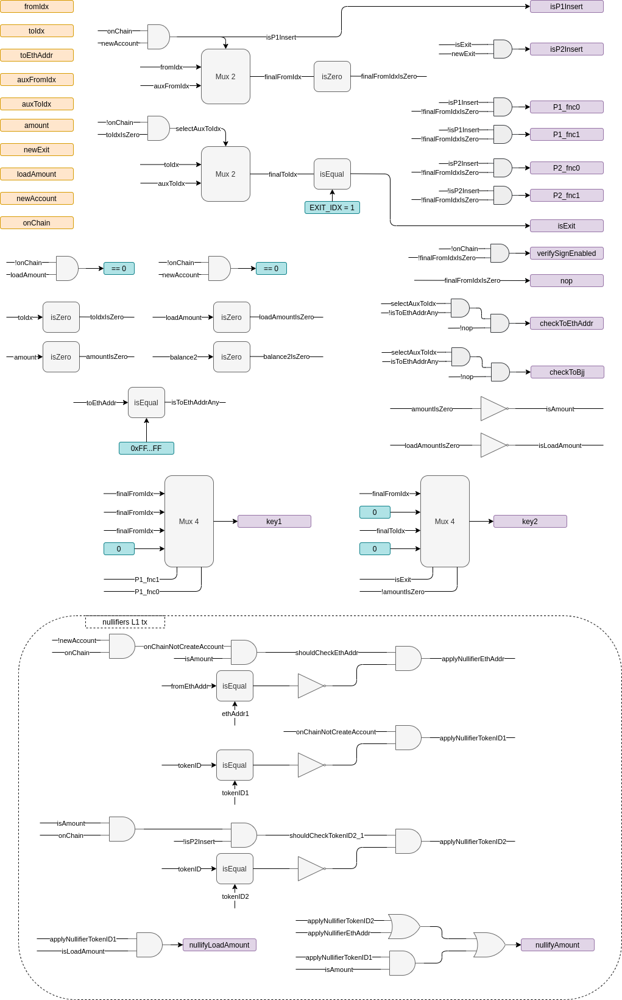

#### Inputs
|    Input    |  type   |                             Description                             |
|:-----------:|:-------:|:-------------------------------------------------------------------:|
|   fromIdx   | uint48  |                            index sender                             |
|    toIdx    | uint48  |                           index receiver                            |
|  toEthAddr  | uint160 |                      ethereum address receiver                      |
| auxFromIdx  | uint48  |                 auxiliary index to create accounts                  |
|  auxToIdx   | uint48  |      auxiliary index when signed index receiver is set to null      |
|   amount    | uint192 |                  amount to transfer from L2 to L2                   |
|   newExit   |  bool   | determines if the transaction create a new account in the exit tree |
| loadAmount  | uint192 |                   amount to deposit from L1 to L2                   |
| newAccount  |  bool   |           determines if transaction creates a new account           |
|   onChain   |  bool   |              determines if the transacion is L1 or L2               |
| fromEthAddr | uint160 |                       ethereum address sender                       |
|  ethAddr1   | uint160 |                   ethereum address of sender leaf                   |
|   tokenID   | uint32  |                  tokenID signed in the transaction                  |
|  tokenID1   | uint32  |                     tokenID of the sender leaf                      |
|  tokenID2   | uint32  |                    tokenID of the receiver leaf                     |

#### Outputs
|      Output       |  type  |                               Description                               |
|:-----------------:|:------:|:-----------------------------------------------------------------------:|
|    isP1Insert     |  bool  |      determines if processor 1 performs an INSERT function (sender)     |
|    isP2Insert     |  bool  |     determines if processor 2 performs an INSERT function (receiver)    |
|       key1        | uint48 |                             processor 1 key                             |
|       key2        | uint48 |                             processor 2 key                             |
|      P1_fnc0      |  bool  |                     processor 1 bit 0 functionality                     |
|      P1_fnc1      |  bool  |                     processor 1 bit 1 functionality                     |
|      P2_fnc0      |  bool  |                     processor 2 bit 0 functionality                     |
|      P2_fnc1      |  bool  |                     processor 2 bit 1 functionality                     |
|      isExit       |  bool  |                determines if the transaction is an exit                 |
| verifySignEnabled |  bool  |         determines if the eddsa signature needs to be verified          |
|        nop        |  bool  | determines if the transaction should be considered as a NOP transaction |
|  checkToEthAddr   |  bool  |       determines if receiver ethereum address needs to be checked       |
|    checkToBjj     |  bool  |          determines if receiver babyjubjub needs to be checked          |
| nullifyLoadAmount |  bool  |             determines if loadAmount is considered to be 0              |
|   nullifyAmount   |  bool  |               determines if amount is considered to be 0                |

### rollup-tx
#### Description
This circuit includes all the rules given a transaction. Hence, `rollup-tx` includes the previous specified circuits:
- `rollup-tx-states`
- `rq-tx-verifier`
- `balance-updater`
- `fee-accumulator`

For the sake of clarity, this circuit could be splitted internally into phases:
- A: compute transaction states
- B: check request transaction
- C: checks state fields
- D: compute hash old states
- E: signal processor selectors
- F: verify eddsa signature
- G: update balances
- H: accumulate fess
- I: compute hash new states
- J: smt processors
- K: select output roots

- Global variables:
  - `nLevels`
  - `maxFeeTx`

#### Schematic

#### Inputs
|            Input            |     type      |                        Description                        |
|:---------------------------:|:-------------:|:---------------------------------------------------------:|
|   feePlanTokens[maxFeeTx]   | uint32 array  |          all tokens eligible to accumulate fees           |
|     accFeeIn[maxFeeTx]      | uint192 array |                 initial fees accumulated                  |
| futureTxCompressedDataV2[3] | uint193 array |          future transactions txCompressedDataV2           |
|  pastTxCompressedDataV2[4]  | uint193 array |                past transactions toEthAddr                |
|     futureToEthAddr[3]      | uint160 array |               future transactions toEthAddr               |
|      pastToEthAddr[4]       | uint160 array |                past transactions toEthAddr                |
|      futureToBjjAy[3]       |  field array  |                future transactions toBjjAy                |
|       pastToBjjAy[4]        |  field array  |                 past transactions toBjjAy                 |
|           fromIdx           |    uint48     |                       index sender                        |
|         auxFromIdx          |    uint48     |            auxiliary index to create accounts             |
|            toIdx            |    uint48     |                      index receiver                       |
|          auxToIdx           |    uint48     | auxiliary index when signed index receiver is set to null |
|           toBjjAy           |     field     |              bayjubjub y coordinate receiver              |
|          toBjjSign          |     bool      |                 babyjubjub sign receiver                  |
|          toEthAddr          |    uint160    |                 ethereum address receiver                 |
|           amount            |    uint192    |             amount to transfer from L2 to L2              |
|           tokenID           |    uint32     |             tokenID signed in the transaction             |
|            nonce            |    uint40     |              nince signed in the transaction              |
|           userFee           |    uint16     |                     user fee selector                     |
|          rqOffset           |     uint3     |                relative linked transaction                |
|           onChain           |     bool      |         determines if the transacion is L1 or L2          |
|         newAccount          |     bool      |      determines if transaction creates a new account      |
|    rqTxCompressedDataV2     |    uint193    |  requested encode transaction fields together version 2   |
|         rqToEthAddr         |    uint160    |            requested ethereum address receiver            |
|          rqToBjjAy          |     field     |             requested babyjubjub y coordinate             |
|          sigL2Hash          |     field     |                   hash L2 data to sign                    |
|              s              |     field     |                   eddsa signature field                   |
|             r8x             |     field     |                   eddsa signature field                   |
|             r8y             |     field     |                   eddsa signature field                   |
|         fromEthAddr         |    uint160    |                  ethereum address sender                  |
|   fromBjjCompressed[256]    | boolean array |               babyjubjub compressed sender                |
|         loadAmountF         |    uint16     |    amount to deposit from L1 to L2 encoded as float16     |
|          tokenID1           |    uint32     |                tokenID of the sender leaf                 |
|           nonce1            |    uint40     |                 nonce of the sender leaf                  |
|            sign1            |     bool      |                  sign of the sender leaf                  |
|          balance1           |    uint192    |                balance of the sender leaf                 |
|             ay1             |     field     |                   ay of the sender leaf                   |
|          ethAddr1           |    uint160    |                ethAddr of the sender leaf                 |
|   siblings1[nLevels + 1]    |  field array  |         siblings merkle proof of the sender leaf          |
|          isOld0_1           |     bool      |              flag to require old key - value              |
|           oldKey1           |    uint48     |                old key of the sender leaf                 |
|          oldValue1          |     field     |               old value of the sender leaf                |
|          tokenID2           |    uint32     |               tokenID of the receiver leaf                |
|           nonce2            |    uint40     |                nonce of the receiver leaf                 |
|            sign2            |     bool      |                 sign of the receiver leaf                 |
|          balance2           |    uint192    |               balance of the receiver leaf                |
|             ay2             |     field     |                  ay of the receiver leaf                  |
|          ethAddr2           |    uint160    |               ethAddr of the receiver leaf                |
|   siblings2[nLevels + 1]    |  field array  |        siblings merkle proof of the receiver leaf         |
|          isOld0_2           |     bool      |              flag to require old key - value              |
|           oldKey2           |    uint48     |                old key of the sender leaf                 |
|          oldValue2          |     field     |               old value of the sender leaf                |
|        oldStateRoot         |     field     |                    initial state root                     |
|         oldExitRoot         |     field     |                     initial exit root                     |

#### Ouputs
|       Output        |     type      |      Description       |
|:-------------------:|:-------------:|:----------------------:|
| accFeeOut[maxFeeTx] | uint192 array | final fees accumulated |
|    newStateRoot     |     field     |    final state root    |
|     newExitRoot     |     field     |    final exit root     |

### rollup-main
#### Description

Join all transactions and process them. This includes decode all possible transactions, process them and distribute all the fees trhough fee transactions.

It is important to note that the templates included in this main circuit are pretended to be computed in parallel. Meaning that the output of the very first transaction could be computed as its output it is not necessary to compute the next transaction. Then, all transactions could be computed in parallel. In order to achieve that, it is needed to supply intermediate signals to allow modules parallelization. 

All signals prefixed with `im` are intermediary signals. Note that in circuit phases, there are specific phases to check integrity of intermediary signals. This adds constraints to the circuit, since it is needed to provided transactions output in advance, but it allows high parallelization at the time to compute the witness.

Note that there is only one piblic input, `hashGlobalInputs`, which is a sha256 hash of all the pretended public inputs of the circuit. This is done in order to save gas in the contract by just passing one public input. 

- Global variables:
  - `nTx`
  - `nLevels`
  - `maxL1Tx`
  - `maxFeeTx`

Main circuit could be splitted in the following phases:
- A: decode transactions
- B: check binary signals
- C: check integrity decode intermediary signals
- D: process transactions
- E: check integrity transactions intermediary signals
- F: process fee transactions
- G: check integrity fee transactions intermediary signals
- H: compute global hash input

#### Schematic

#### Inputs
|            Input             |       type        |                               Description                               |
|:----------------------------:|:-----------------:|:-----------------------------------------------------------------------:|
|          oldLastIdx          |      uint48       |                         old last index assigned                         |
|         oldStateRoot         |       field       |                           initial state root                            |
|        globalChainID         |      uint16       |                         global chain identifier                         |
|      feeIdxs[maxFeeTx]       |   uint48 array    |                   merkle tree indexes to receive fees                   |
|   feePlanTokens[maxFeeTx]    |   uint32 array    |                 tokens identifiers of fees accumulated                  |
|       imOnChain[nTx-1]       |   boolean array   |      intermediary signals: decode transaction output onChain flag       |
|       imOutIdx[nTx-1]        |   uint48 array    |      intermediary signals: decode transaction final index assigned      |
|      imStateRoot[nTx-1]      |    field array    |           intermediary signals: transaction final state root            |
|      imExitRoot[nTx-1]       |    field array    |            intermediary signals: transaction final exit root            |
| imAccFeeOut[nTx-1][maxFeeTx] |   uint192 array   |         intermediary signals: transaction final accumlate fees          |
| imStateRootFee[maxFeeTx - 1] |    field array    |         intermediary signals: transaction fee final state root          |
|      imInitStateRootFee      |       field       |    intermediary signals: final state root of all rollup transactions    |
|   imFinalAccFee[maxFeeTx]    |    field array    | intermediary signals: final fees accumulated of all rollup transactions |
|    txCompressedData[nTx]     |   uint241 array   |                   encode transaction fields together                    |
|   txCompressedDataV2[nTx]    |   uint193 array   |              encode transaction fields together version 2               |
|         fromIdx[nTx]         |   uint48 array    |                              index sender                               |
|       auxFromIdx[nTx]        |   uint48 array    |                   auxiliary index to create accounts                    |
|          toIdx[nTx]          |   uint48 array    |                             index receiver                              |
|        auxToIdx[nTx]         |   uint48 array    |        auxiliary index when signed index receiver is set to null        |
|         toBjjAy[nTx]         |    field array    |                     bayjubjub y coordinate receiver                     |
|        toEthAddr[nTx]        |   uint160 array   |                        ethereum address receiver                        |
|         onChain[nTx]         |    bool array     |                determines if the transacion is L1 or L2                 |
|       newAccount[nTx]        |    bool array     |             determines if transaction creates a new account             |
|  rqTxCompressedDataV2[nTx]   |   uint193 array   |         requested encode transaction fields together version 2          |
|       rqToEthAddr[nTx]       |   uint160 array   |                   requested ethereum address receiver                   |
|        rqToBjjAy[nTx]        |    field array    |                    requested babyjubjub y coordinate                    |
|            s[nTx]            |    field array    |                          eddsa signature field                          |
|           r8x[nTx]           |    field array    |                          eddsa signature field                          |
|           r8y[nTx]           |    field array    |                          eddsa signature field                          |
|       loadAmountF[nTx]       |   uint16 array    |           amount to deposit from L1 to L2 encoded as float16            |
|       fromEthAddr[nTx]       |   uint160 array   |                         ethereum address sender                         |
| fromBjjCompressed[nTx][256]  |   boolean array   |                      babyjubjub compressed sender                       |
|        tokenID1[nTx]         |   uint32 array    |                       tokenID of the sender leaf                        |
|         nonce1[nTx]          |   uint40 array    |                        nonce of the sender leaf                         |
|          sign1[nTx]          |    bool array     |                         sign of the sender leaf                         |
|        balance1[nTx]         |   uint192 array   |                       balance of the sender leaf                        |
|           ay1[nTx]           |    field array    |                          ay of the sender leaf                          |
|        ethAddr1[nTx]         |   uint160 array   |                       ethAddr of the sender leaf                        |
| siblings1[nTx][nLevels + 1]  |    field array    |                siblings merkle proof of the sender leaf                 |
|        isOld0_1[nTx]         |    bool array     |                     flag to require old key - value                     |
|         oldKey1[nTx]         |   uint48 array    |                       old key of the sender leaf                        |
|        oldValue1[nTx]        |    field array    |                      old value of the sender leaf                       |
|        tokenID2[nTx]         |   uint32 array    |                      tokenID of the receiver leaf                       |
|         nonce2[nTx]          |   uint40 array    |                       nonce of the receiver leaf                        |
|          sign2[nTx]          |    bool array     |                        sign of the receiver leaf                        |
|        balance2[nTx]         |   uint192 array   |                      balance of the receiver leaf                       |
|           ay2[nTx]           |    field array    |                         ay of the receiver leaf                         |
|        ethAddr2[nTx]         |   uint160 array   |                      ethAddr of the receiver leaf                       |
| siblings2[nTx][nLevels + 1]  |    field array    |               siblings merkle proof of the receiver leaf                |
|        isOld0_2[nTx]         |    bool array     |                     flag to require old key - value                     |
|         oldKey2[nTx]         |   uint48 array    |                       old key of the sender leaf                        |
|        oldValue2[nTx]        |    field array    |                      old value of the sender leaf                       |
|      tokenID3[maxFeeTx]      |   uint32 array    |                        tokenID of leafs feeIdxs                         |
|       nonce3[maxFeeTx]       |   uint40 array    |                         nonce of leafs feeIdxs                          |
|       sign3[maxFeeTx]        |    bool array     |                          sign of leafs feeIdxs                          |
|      balance3[maxFeeTx]      |   uint192 array   |                        balance of leafs feeIdxs                         |
|        ay3[maxFeeTx]         |    field array    |                           ay of leafs feeIdxs                           |
|      ethAddr3[maxFeeTx]      |   uint160 array   |                        ethAddr of leafs feeIdxs                         |
|    siblings3[nLevels + 1]    | field array       |                   siblings merkle proof of leafs Idxs                   |

#### Outputs
|      Output      | type  |             Description             |
|:----------------:|:-----:|:-----------------------------------:|
| hashGlobalInputs | field | hash of all pretended input signals |

## Withdraw
#### Description
This circuit is used to prove that a leaf exist on the exit tree. If its existence is proved, user will be able to withdraw funds from the hermez contract.
All pretended public inputs are hashed together as described [here](developers/protocol/hermez-protocol/protocol?id=hermezwithdraw).

- Steps:
  - compute hash-state
  - verify state exist in the exit tree root given the siblings
  - compute `hashGlobalInputs`

> It should be noted that this circuit is heavily attach with the [hermez smart contract](developers/protocol/hermez-protocol/contracts/contracts?id=hermez-smart-contracts) 

- Global variables
  - `nLevels` 

#### Schematic

#### Inputs
|            Input            |    type     |                    Description                    |
|:---------------------------:|:-----------:|:-------------------------------------------------:|
|          root exit          |    field    |                  exit tree root                   |
|           ethAddr           |   uint160   |                 ethereum address                  |
|           tokenID           |   uint32    |                 token identifier                  |
|           balance           |   uint192   |                      balance                      |
|             idx             |   uint48    |                 merkle tree index                 |
|            sign             |   boolean   |                  babyjubjub sign                  |
|             ay              |    field    |              babyjubjub y coordinate              |
| siblingsState[nLevels +  1] | field array |               siblings merkle proof               |

#### Outputs
|      Output      | type  |             Description             |
|:----------------:|:-----:|:-----------------------------------:|
| hashGlobalInputs | field | hash of all pretended input signals |
