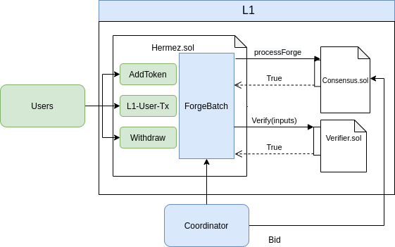
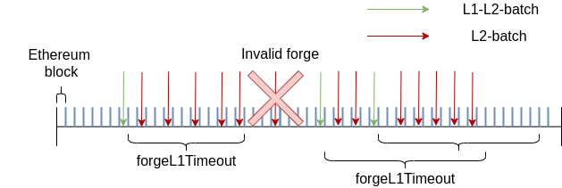
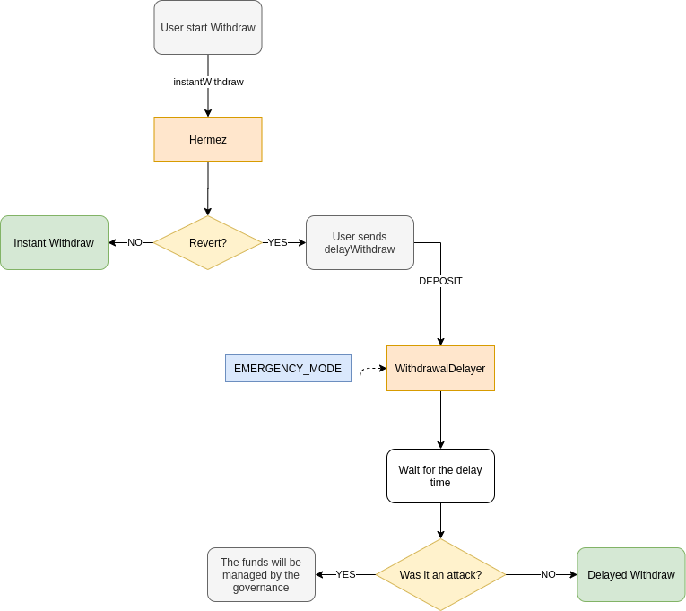

# Hermez smart contracts

## Glossary

- Batch: Set of transactions that determines a state transition of the accounts and sets an exit tree.
  - L2-Batch: The set of transactions are only L2
  - L1-L2-Batch: The set of transactions are L1 or L2

## Hermez general goals

- Handle L1-user transactions

  - Ensure that these transactions are forged

- Forge batches

  - Ask consensus algorithm for coordinator approval
  - Add L1 Coordinator Transactions
  - Ensures that state transitions are valid through a validity proof which will assure that certain rules has been fulfilled.
  - Set a new state merkle root and exit merkle root

- Utility actions
  - Withdraw funds or add new tokens to the rollup



### Handle L1 user transactions

All L1UserTx are encoded and added to a queue, when the queue is full or frozen, a new queue is created.
Once a queue is frozen means that L1 transactions can't be added anymore.
Each queue is identified by a index that grows incrementally.
The queue index of the next L1-L2-batch is always frozen wich is identified by `nextL1ToForgeQueue`

When a user calls a function that adds an L1UserTx, the following happens:

- Storage
  - Add the L1UserTx data at the end of the last non-frozen non-full queue of L1UserTxs (`mapL1TxQueue[nextL1FillingQueue]`).
    - The queue index in which this data is added is identified by `nextL1FillingQueue`
    - The L1UserTxs is encoded as a byte array data and appended to the queue
    - Once the `nextL1FillingQueue` is full, increment the `nextL1FillingQueue`
- Event information
  - nextL1FillingQueue
  - position
  - L1UserTx data (72 bytes)

In the global spec are specified all the [L1 user transactions](developers/protocol/hermez-protocol/protocol?id=l1-user-transactions)

The `L1TxQueue` has a lenght of `MAX_L1_TX`, L1UserTx can fulfill till `MAX_L1_USER_TX`, therefore always are some slots reserved for the L1-coordinator-Tx:
`MAX_L1_TX - len(L1_USER_TXS)`

### Utility actions

#### Add tokens

Hermez has a list of all the tokens that rollup supports.
Tokens must be an ERC20, and everyone can add a new token with this method.
A fee in HEZ must be payed to the governance address.

#### Withdraw

Transaction to get funds back from smart contract to ethereum address. This is done by proving the existence of a leaf in the exit tree. Once the withdraw is done a nullifier is set, so this only can happen once

> Remember withdraw is not a L1 transaction, it has no impact in the state or exit trees and it's not processed by the circuit.

### Forging

The `forgeBatch` functionality depends on a consensus mechanism to decide who
can be the coordinator of a given batch. Separate from the rollup smart
contract, there is an external smart contract that implements the consensus
mechanism and maintains its own state. During a forge call in the rollup smart
contract, a call is made to the consensus smart contract to validate if the
caller coordinator is allowed to forge and also to allow the consensus smart
contract to update its own state and perform consensus actions if necessary.

Then, the coordinator will add his [L1-coordinator-transactions](developers/protocol/hermez-protocol/contracts/contracts?id=l1-coordinator-transactions) and will verify the circuit proof against the verifier smart contract as we can see in the previous [diagram](developers/protocol/hermez-protocol/contracts/contracts?id=hermez-general-goals)

There are 2 kind of `forgeBatch`, a flag in the function will distinguish between them

- L2-batch
  - Forge L2 and L1 coordinator transactions, L1 User transactions are not mined.
- L1-L2-batch
  - Forge L1 user, L1 coordinator and L2 transactions. The coordinator must forge all the L1 transactions in the first frozen queue
  - Optionally coordinator can add [L1-coordinator-transactions](developers/protocol/hermez-protocol/contracts/contracts?id=l1-coordinator-transactions)
  - Set a new state and exit root
  - Delete the current frozen queue and freeze the next one

In order to force the coordinator to forge the L1 transactions, but also allow him to parallelize his proof computation, the contract establish a deadline for the L1-L2-batches. Every L1-L2-batches reset the deadline, so, as shown in the diagram, the coordinator is free to choose to forge L2-batches or L1-L2-barches until the deadline, when only L1-L2-batches are accepted.



#### L1 coordinator transactions

In the global spec are specified all the [L1 coordinator transactions](developers/protocol/hermez-protocol/protocol?id=l1-coordinator)

#### Data availability

- L1-User-Tx --> Events
- L1-Coordinator-Tx --> `forgeBatch` ethereum Tx Input
- L2-Tx --> `forgeBatch` ethereum Tx Input

In order to provide data availability the `forgeBatch` transaction inputs must be recovered. To allow this data retrieval from a regular ethereum node, hermez must force that the call is not made from another smart contract:

```
assert(msg.sender == tx.origin)

```

### Governance

The governance will be able to set the following parameters:

- forgeL1L2BatchTimeout
  - Number of ethereum blocks after the last L1-L2-batch after which only an L1-L2-batch can be forged
- feeAddToken
  - Fee in HEZ tokens that must be payed to the governance to add a new token into the rollup
- tokenExchange
  - Update the tokenUSD value for the instant Withdraw purposes
- withdrawalDelay
  - Delay in seconds of the delayed withdraw
- buckets
  - Update buckets parameters for the instant Withdraw purposes

### Emergency mechanism

#### Goal

This logic is implemented in order to mitigate attacks that could potentially steal funds from hermez network. The aim of this method is to mitigate funds stolen while preserving decentralization.

The core mechanism is to set a withdrawal limit in order to avoid infinite withdrawal in case of funds stolen. Therefore, it is assured that the attacker can only steal a certain amount of tokens.

#### Hermez withdraw limit

There will be a histogram of maximum amount of withdrawals in a value range:

- Limits the maximum amount to withdraw
- Value range is set in USD
- Buckets are filled in a blockRatio
- If a withdraw reaches the histogram limit, an instant withdraw cannot be performed

Every time a user tries to perform an instant withdraw:

- Updates the counter of the histogram
- If the counter is above the capacity of that range, instant withdraw is reverted


> Note that `withdraw limit` would be the maximum amount of tokens that an attacker can steal since the contract will return `revert` when the instant withdraw is called again and there are no tokens left to send.
> The histogram is understood as buckets.

#### Mechanism

The number of withdraws above the `withdraw limit` can not be withdrawn instantly, there will be a delay. Tokens will be sent to the `WithdrawalDelayer` smart contract.

Users will be able to perform instant withdrawals as long as `Hermez Contract` does not reach the `withdrawal limit`, that is, it runs out of withdraws available in the bucket (in the bucket with that price range).

Actions that will be taken if the `withdrawal limit` is reached are the following ones:

- If a user does an `instantWithdraw`, `Hermez Contract` will return `revert`.
- If a user does a `delayWithdraw`, it will be accepted and the tokens will be sent to `WithdrawalDelayer`. The user can withdraw their tokens but with a delay.

There will be a delay time `withdrawalDelay` (parameter of the `WithdrawalDelayer` contract) during which the Hermez foundation can decide if there has been an attack or not:

- Not attack:

  - When enough blocks have passed for the bucket to refill, `Hermez Contract` will accept `instantWithdraw` again, while withdrawals are available in the bucket.

- Attack:

  - The histogram values will all be set to 0 (change to `safe mode`) so that all tokens are sent to `WithdrawalDelayer` until the histogram values are changed again.

- If a decision is not made in the defined period:
  - When enough blocks have passed for the bucket to refill, `Hermez Contract` will accept `instantWithdraw` again.



> Hermez network foundation will be monitoring constantly the system in order to detect possible anomalies and to be able to decide as soon as possible if they are an attack.

#### Parameters

- Bucket (part of histogram):
  - `ceilUSD`: maximum amount to allow instant withdrawals (bucket range)
  - `blockStamp`: last time a withdrawal was added ( or removed if the bucket was full)
  - `withdrawals`: available withdrawals of the bucket
  - `blockWithdrawalRate`: every x blocks add 1 withdrawal
  - `maxWithdrawals`: max withdrawals the bucket can hold
- `NUM_BUCKETS`: number of buckets in histogram
- `tokenExchange`: mapping `tokenAddress --> USD value` (default 0, means that no limit applies)
