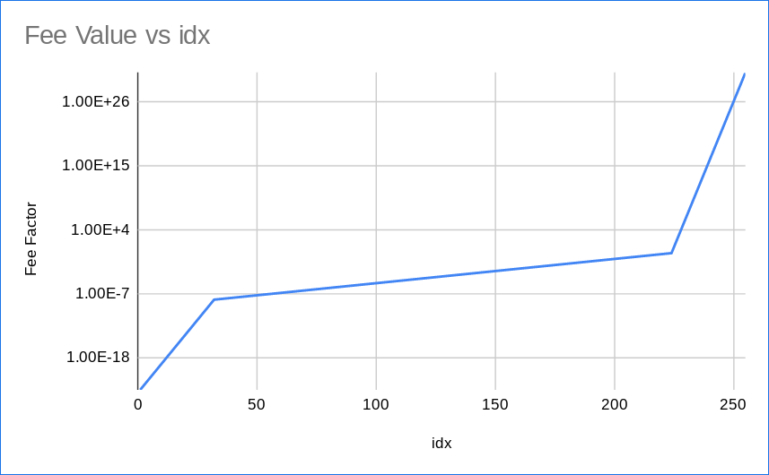

# Transaction Fee Table

Fees in L2 transaction apply a factor encoded by an index, as shown in the table above and the formula below:

$0 \text{ if } i = 0$

$10^{-24 + \frac{i}{2}} \text{if } 1 \leq i \leq 32$

$10^{-8 + \frac{8}{192} (i - 32) } \text{if } 33 \leq i \leq 223$

$10^{i - 224} \text{ if } 224 \leq i \leq 255$

This is the complete table of the fees factors by index:

| feeUser |   exponent             | feeFactor |
|:---:|:--------------:|:----------:|
|  0  |       0        |     0      |
|  1  |     -23.5      |  3.16E-24  |
|  2  |      -23       |  1.00E-23  |
|  3  |     -22.5      |  3.16E-23  |
|  4  |      -22       |  1.00E-22  |
|  5  |     -21.5      |  3.16E-22  |
|  6  |      -21       |  1.00E-21  |
|  7  |     -20.5      |  3.16E-21  |
|  8  |      -20       |  1.00E-20  |
|  9  |     -19.5      |  3.16E-20  |
| 10  |      -19       |  1.00E-19  |
| 11  |     -18.5      |  3.16E-19  |
| 12  |      -18       |  1.00E-18  |
| 13  |     -17.5      |  3.16E-18  |
| 14  |      -17       |  1.00E-17  |
| 15  |     -16.5      |  3.16E-17  |
| 16  |      -16       |  1.00E-16  |
| 17  |     -15.5      |  3.16E-16  |
| 18  |      -15       |  1.00E-15  |
| 19  |     -14.5      |  3.16E-15  |
| 20  |      -14       |  1.00E-14  |
| 21  |     -13.5      |  3.16E-14  |
| 22  |      -13       |  1.00E-13  |
| 23  |     -12.5      |  3.16E-13  |
| 24  |      -12       |  1.00E-12  |
| 25  |     -11.5      |  3.16E-12  |
| 26  |      -11       |  1.00E-11  |
| 27  |     -10.5      |  3.16E-11  |
| 28  |      -10       |  1.00E-10  |
| 29  |      -9.5      |  3.16E-10  |
| 30  |       -9       |  1.00E-09  |
| 31  |      -8.5      |  3.16E-09  |
| 32  |       -8       |  1.00E-08  |
| 33  |  -7.958333333  |  1.10E-08  |
| 34  |  -7.916666667  |  1.21E-08  |
| 35  |     -7.875     |  1.33E-08  |
| 36  |  -7.833333333  |  1.47E-08  |
| 37  |  -7.791666667  |  1.62E-08  |
| 38  |     -7.75      |  1.78E-08  |
| 39  |  -7.708333333  |  1.96E-08  |
| 40  |  -7.666666667  |  2.15E-08  |
| 41  |     -7.625     |  2.37E-08  |
| 42  |  -7.583333333  |  2.61E-08  |
| 43  |  -7.541666667  |  2.87E-08  |
| 44  |      -7.5      |  3.16E-08  |
| 45  |  -7.458333333  |  3.48E-08  |
| 46  |  -7.416666667  |  3.83E-08  |
| 47  |     -7.375     |  4.22E-08  |
| 48  |  -7.333333333  |  4.64E-08  |
| 49  |  -7.291666667  |  5.11E-08  |
| 50  |     -7.25      |  5.62E-08  |
| 51  |  -7.208333333  |  6.19E-08  |
| 52  |  -7.166666667  |  6.81E-08  |
| 53  |     -7.125     |  7.50E-08  |
| 54  |  -7.083333333  |  8.25E-08  |
| 55  |  -7.041666667  |  9.09E-08  |
| 56  |       -7       |  1.00E-07  |
| 57  |  -6.958333333  |  1.10E-07  |
| 58  |  -6.916666667  |  1.21E-07  |
| 59  |     -6.875     |  1.33E-07  |
| 60  |  -6.833333333  |  1.47E-07  |
| 61  |  -6.791666667  |  1.62E-07  |
| 62  |     -6.75      |  1.78E-07  |
| 63  |  -6.708333333  |  1.96E-07  |
| 64  |  -6.666666667  |  2.15E-07  |
| 65  |     -6.625     |  2.37E-07  |
| 66  |  -6.583333333  |  2.61E-07  |
| 67  |  -6.541666667  |  2.87E-07  |
| 68  |      -6.5      |  3.16E-07  |
| 69  |  -6.458333333  |  3.48E-07  |
| 70  |  -6.416666667  |  3.83E-07  |
| 71  |     -6.375     |  4.22E-07  |
| 72  |  -6.333333333  |  4.64E-07  |
| 73  |  -6.291666667  |  5.11E-07  |
| 74  |     -6.25      |  5.62E-07  |
| 75  |  -6.208333333  |  6.19E-07  |
| 76  |  -6.166666667  |  6.81E-07  |
| 77  |     -6.125     |  7.50E-07  |
| 78  |  -6.083333333  |  8.25E-07  |
| 79  |  -6.041666667  |  9.09E-07  |
| 80  |       -6       |  1.00E-06  |
| 81  |  -5.958333333  |  1.10E-06  |
| 82  |  -5.916666667  |  1.21E-06  |
| 83  |     -5.875     |  1.33E-06  |
| 84  |  -5.833333333  |  1.47E-06  |
| 85  |  -5.791666667  |  1.62E-06  |
| 86  |     -5.75      |  1.78E-06  |
| 87  |  -5.708333333  |  1.96E-06  |
| 88  |  -5.666666667  |  2.15E-06  |
| 89  |     -5.625     |  2.37E-06  |
| 90  |  -5.583333333  |  2.61E-06  |
| 91  |  -5.541666667  |  2.87E-06  |
| 92  |      -5.5      |  3.16E-06  |
| 93  |  -5.458333333  |  3.48E-06  |
| 94  |  -5.416666667  |  3.83E-06  |
| 95  |     -5.375     |  4.22E-06  |
| 96  |  -5.333333333  |  4.64E-06  |
| 97  |  -5.291666667  |  5.11E-06  |
| 98  |     -5.25      |  5.62E-06  |
| 99  |  -5.208333333  |  6.19E-06  |
| 100 |  -5.166666667  |  6.81E-06  |
| 101 |     -5.125     |  7.50E-06  |
| 102 |  -5.083333333  |  8.25E-06  |
| 103 |  -5.041666667  |  9.09E-06  |
| 104 |       -5       |  1.00E-05  |
| 105 |  -4.958333333  |  1.10E-05  |
| 106 |  -4.916666667  |  1.21E-05  |
| 107 |     -4.875     |  1.33E-05  |
| 108 |  -4.833333333  |  1.47E-05  |
| 109 |  -4.791666667  |  1.62E-05  |
| 110 |     -4.75      |  1.78E-05  |
| 111 |  -4.708333333  |  1.96E-05  |
| 112 |  -4.666666667  |  2.15E-05  |
| 113 |     -4.625     |  2.37E-05  |
| 114 |  -4.583333333  |  2.61E-05  |
| 115 |  -4.541666667  |  2.87E-05  |
| 116 |      -4.5      |  3.16E-05  |
| 117 |  -4.458333333  |  3.48E-05  |
| 118 |  -4.416666667  |  3.83E-05  |
| 119 |     -4.375     |  4.22E-05  |
| 120 |  -4.333333333  |  4.64E-05  |
| 121 |  -4.291666667  |  5.11E-05  |
| 122 |     -4.25      |  5.62E-05  |
| 123 |  -4.208333333  |  6.19E-05  |
| 124 |  -4.166666667  |  6.81E-05  |
| 125 |     -4.125     |  7.50E-05  |
| 126 |  -4.083333333  |  8.25E-05  |
| 127 |  -4.041666667  |  9.09E-05  |
| 128 |       -4       |  1.00E-04  |
| 129 |  -3.958333333  |  1.10E-04  |
| 130 |  -3.916666667  |  1.21E-04  |
| 131 |     -3.875     |  1.33E-04  |
| 132 |  -3.833333333  |  1.47E-04  |
| 133 |  -3.791666667  |  1.62E-04  |
| 134 |     -3.75      |  1.78E-04  |
| 135 |  -3.708333333  |  1.96E-04  |
| 136 |  -3.666666667  |  2.15E-04  |
| 137 |     -3.625     |  2.37E-04  |
| 138 |  -3.583333333  |  2.61E-04  |
| 139 |  -3.541666667  |  2.87E-04  |
| 140 |      -3.5      |  3.16E-04  |
| 141 |  -3.458333333  |  3.48E-04  |
| 142 |  -3.416666667  |  3.83E-04  |
| 143 |     -3.375     |  4.22E-04  |
| 144 |  -3.333333333  |  4.64E-04  |
| 145 |  -3.291666667  |  5.11E-04  |
| 146 |     -3.25      |  5.62E-04  |
| 147 |  -3.208333333  |  6.19E-04  |
| 148 |  -3.166666667  |  6.81E-04  |
| 149 |     -3.125     |  7.50E-04  |
| 150 |  -3.083333333  |  8.25E-04  |
| 151 |  -3.041666667  |  9.09E-04  |
| 152 |       -3       |  1.00E-03  |
| 153 |  -2.958333333  |  1.10E-03  |
| 154 |  -2.916666667  |  1.21E-03  |
| 155 |     -2.875     |  1.33E-03  |
| 156 |  -2.833333333  |  1.47E-03  |
| 157 |  -2.791666667  |  1.62E-03  |
| 158 |     -2.75      |  1.78E-03  |
| 159 |  -2.708333333  |  1.96E-03  |
| 160 |  -2.666666667  |  2.15E-03  |
| 161 |     -2.625     |  2.37E-03  |
| 162 |  -2.583333333  |  2.61E-03  |
| 163 |  -2.541666667  |  2.87E-03  |
| 164 |      -2.5      |  3.16E-03  |
| 165 |  -2.458333333  |  3.48E-03  |
| 166 |  -2.416666667  |  3.83E-03  |
| 167 |     -2.375     |  4.22E-03  |
| 168 |  -2.333333333  |  4.64E-03  |
| 169 |  -2.291666667  |  5.11E-03  |
| 170 |     -2.25      |  5.62E-03  |
| 171 |  -2.208333333  |  6.19E-03  |
| 172 |  -2.166666667  |  6.81E-03  |
| 173 |     -2.125     |  7.50E-03  |
| 174 |  -2.083333333  |  8.25E-03  |
| 175 |  -2.041666667  |  9.09E-03  |
| 176 |       -2       |  1.00E-02  |
| 177 |  -1.958333333  |  1.10E-02  |
| 178 |  -1.916666667  |  1.21E-02  |
| 179 |     -1.875     |  1.33E-02  |
| 180 |  -1.833333333  |  1.47E-02  |
| 181 |  -1.791666667  |  1.62E-02  |
| 182 |     -1.75      |  1.78E-02  |
| 183 |  -1.708333333  |  1.96E-02  |
| 184 |  -1.666666667  |  2.15E-02  |
| 185 |     -1.625     |  2.37E-02  |
| 186 |  -1.583333333  |  2.61E-02  |
| 187 |  -1.541666667  |  2.87E-02  |
| 188 |      -1.5      |  3.16E-02  |
| 189 |  -1.458333333  |  3.48E-02  |
| 190 |  -1.416666667  |  3.83E-02  |
| 191 |     -1.375     |  4.22E-02  |
| 192 |  -1.333333333  |  4.64E-02  |
| 193 |  -1.291666667  |  5.11E-02  |
| 194 |     -1.25      |  5.62E-02  |
| 195 |  -1.208333333  |  6.19E-02  |
| 196 |  -1.166666667  |  6.81E-02  |
| 197 |     -1.125     |  7.50E-02  |
| 198 |  -1.083333333  |  8.25E-02  |
| 199 |  -1.041666667  |  9.09E-02  |
| 200 |       -1       |  1.00E-01  |
| 201 | -0.9583333333  |  1.10E-01  |
| 202 | -0.9166666667  |  1.21E-01  |
| 203 |     -0.875     |  1.33E-01  |
| 204 | -0.8333333333  |  1.47E-01  |
| 205 | -0.7916666667  |  1.62E-01  |
| 206 |     -0.75      |  1.78E-01  |
| 207 | -0.7083333333  |  1.96E-01  |
| 208 | -0.6666666667  |  2.15E-01  |
| 209 |     -0.625     |  2.37E-01  |
| 210 | -0.5833333333  |  2.61E-01  |
| 211 | -0.5416666667  |  2.87E-01  |
| 212 |      -0.5      |  3.16E-01  |
| 213 | -0.4583333333  |  3.48E-01  |
| 214 | -0.4166666667  |  3.83E-01  |
| 215 |     -0.375     |  4.22E-01  |
| 216 | -0.3333333333  |  4.64E-01  |
| 217 | -0.2916666667  |  5.11E-01  |
| 218 |     -0.25      |  5.62E-01  |
| 219 | -0.2083333333  |  6.19E-01  |
| 220 | -0.1666666667  |  6.81E-01  |
| 221 |     -0.125     |  7.50E-01  |
| 222 | -0.08333333333 |  8.25E-01  |
| 223 | -0.04166666667 |  9.09E-01  |
| 224 |       0        |  1.00E+00  |
| 225 |       1        |  1.00E+01  |
| 226 |       2        |  1.00E+02  |
| 227 |       3        |  1.00E+03  |
| 228 |       4        |  1.00E+04  |
| 229 |       5        |  1.00E+05  |
| 230 |       6        |  1.00E+06  |
| 231 |       7        |  1.00E+07  |
| 232 |       8        |  1.00E+08  |
| 233 |       9        |  1.00E+09  |
| 234 |       10       |  1.00E+10  |
| 235 |       11       |  1.00E+11  |
| 236 |       12       |  1.00E+12  |
| 237 |       13       |  1.00E+13  |
| 238 |       14       |  1.00E+14  |
| 239 |       15       |  1.00E+15  |
| 240 |       16       |  1.00E+16  |
| 241 |       17       |  1.00E+17  |
| 242 |       18       |  1.00E+18  |
| 243 |       19       |  1.00E+19  |
| 244 |       20       |  1.00E+20  |
| 245 |       21       |  1.00E+21  |
| 246 |       22       |  1.00E+22  |
| 247 |       23       |  1.00E+23  |
| 248 |       24       |  1.00E+24  |
| 249 |       25       |  1.00E+25  |
| 250 |       26       |  1.00E+26  |
| 251 |       27       |  1.00E+27  |
| 252 |       28       |  1.00E+28  |
| 253 |       29       |  1.00E+29  |
| 254 |       30       |  1.00E+30  |
| 255 |       31       |  1.00E+31  |

## FeeFactor left shifted

| feeUser |                     feeFactor << 79                     |
|:---:|:-------------------------------------------------------:|
|  0  |                            0                            |
|  1  |                            1                            |
|  2  |                            6                            |
|  3  |                           19                            |
|  4  |                           60                            |
|  5  |                           191                           |
|  6  |                           604                           |
|  7  |                          1911                           |
|  8  |                          6044                           |
|  9  |                          19114                          |
| 10  |                          60446                          |
| 11  |                         191147                          |
| 12  |                         604462                          |
| 13  |                         1911479                         |
| 14  |                         6044629                         |
| 15  |                        19114795                         |
| 16  |                        60446290                         |
| 17  |                        191147955                        |
| 18  |                        604462909                        |
| 19  |                       1911479556                        |
| 20  |                       6044629098                        |
| 21  |                       19114795560                       |
| 22  |                       60446290980                       |
| 23  |                      191147955608                       |
| 24  |                      604462909807                       |
| 25  |                      1911479556084                      |
| 26  |                      6044629098073                      |
| 27  |                     19114795560840                      |
| 28  |                     60446290980731                      |
| 29  |                     191147955608404                     |
| 30  |                     604462909807314                     |
| 31  |                    1911479556084045                     |
| 32  |                    6044629098073146                     |
| 33  |                    6653288015630616                     |
| 34  |                    7323235338466790                     |
| 35  |                    8060642451758603                     |
| 36  |                    8872302163198820                     |
| 37  |                    9765691276621298                     |
| 38  |                    10749039466425620                    |
| 39  |                    11831405087254648                    |
| 40  |                    13022758617264914                    |
| 41  |                    14334074503647984                    |
| 42  |                    15777432256460256                    |
| 43  |                    17366127722012378                    |
| 44  |                    19114795560840448                    |
| 45  |                    21039544058494708                    |
| 46  |                    23158103510989148                    |
| 47  |                    25489989551801104                    |
| 48  |                    28056682924947216                    |
| 49  |                    30881827360160752                    |
| 50  |                    33991447372945972                    |
| 51  |                    37414187995827888                    |
| 52  |                    41181578649142096                    |
| 53  |                    45328323582075176                    |
| 54  |                    49892621559424256                    |
| 55  |                    54916517738950528                    |
| 56  |                    60446290980731456                    |
| 57  |                    66532880156306032                    |
| 58  |                    73232353384667904                    |
| 59  |                    80606424517586032                    |
| 60  |                    88723021631988016                    |
| 61  |                    97656912766212992                    |
| 62  |                   107490394664256192                    |
| 63  |                   118314050872546240                    |
| 64  |                   130227586172649136                    |
| 65  |                   143340745036479856                    |
| 66  |                   157774322564602240                    |
| 67  |                   173661277220123776                    |
| 68  |                   191147955608404480                    |
| 69  |                   210395440584946624                    |
| 70  |                   231581035109891488                    |
| 71  |                   254899895518011040                    |
| 72  |                   280566829249471584                    |
| 73  |                   308818273601607552                    |
| 74  |                   339914473729459712                    |
| 75  |                   374141879958278144                    |
| 76  |                   411815786491420928                    |
| 77  |                   453283235820751744                    |
| 78  |                   498926215594241536                    |
| 79  |                   549165177389505280                    |
| 80  |                   604462909807314560                    |
| 81  |                   665328801563060352                    |
| 82  |                   732323533846679040                    |
| 83  |                   806064245175860224                    |
| 84  |                   887230216319880192                    |
| 85  |                   976569127662129920                    |
| 86  |                   1074903946642562048                   |
| 87  |                   1183140508725462528                   |
| 88  |                   1302275861726491392                   |
| 89  |                   1433407450364798464                   |
| 90  |                   1577743225646022400                   |
| 91  |                   1736612772201237760                   |
| 92  |                   1911479556084044800                   |
| 93  |                   2103954405849466368                   |
| 94  |                   2315810351098914816                   |
| 95  |                   2548998955180110336                   |
| 96  |                   2805668292494715904                   |
| 97  |                   3088182736016075264                   |
| 98  |                   3399144737294597120                   |
| 99  |                   3741418799582781440                   |
| 100 |                   4118157864914209280                   |
| 101 |                   4532832358207517184                   |
| 102 |                   4989262155942415360                   |
| 103 |                   5491651773895053312                   |
| 104 |                   6044629098073145344                   |
| 105 |                   6653288015630603264                   |
| 106 |                   7323235338466789376                   |
| 107 |                   8060642451758603264                   |
| 108 |                   8872302163198801920                   |
| 109 |                   9765691276621297664                   |
| 110 |                  10749039466425620480                   |
| 111 |                  11831405087254624256                   |
| 112 |                  13022758617264914432                   |
| 113 |                  14334074503647985664                   |
| 114 |                  15777432256460224512                   |
| 115 |                  17366127722012377088                   |
| 116 |                  19114795560840450048                   |
| 117 |                  21039544058494664704                   |
| 118 |                  23158103510989152256                   |
| 119 |                  25489989551801102336                   |
| 120 |                  28056682924947156992                   |
| 121 |                  30881827360160751616                   |
| 122 |                  33991447372945973248                   |
| 123 |                  37414187995827814400                   |
| 124 |                  41181578649142091776                   |
| 125 |                  45328323582075174912                   |
| 126 |                  49892621559424155648                   |
| 127 |                  54916517738950524928                   |
| 128 |                  60446290980731453440                   |
| 129 |                  66532880156306030592                   |
| 130 |                  73232353384667897856                   |
| 131 |                  80606424517586026496                   |
| 132 |                  88723021631988023296                   |
| 133 |                  97656912766212980736                   |
| 134 |                  107490394664256208896                  |
| 135 |                  118314050872546246656                  |
| 136 |                  130227586172649144320                  |
| 137 |                  143340745036479856640                  |
| 138 |                  157774322564602232832                  |
| 139 |                  173661277220123770880                  |
| 140 |                  191147955608404492288                  |
| 141 |                  210395440584946647040                  |
| 142 |                  231581035109891506176                  |
| 143 |                  254899895518011031552                  |
| 144 |                  280566829249471578112                  |
| 145 |                  308818273601607499776                  |
| 146 |                  339914473729459748864                  |
| 147 |                  374141879958278111232                  |
| 148 |                  411815786491420934144                  |
| 149 |                  453283235820751683584                  |
| 150 |                  498926215594241556480                  |
| 151 |                  549165177389505314816                  |
| 152 |                  604462909807314599936                  |
| 153 |                  665328801563060338688                  |
| 154 |                  732323533846678994944                  |
| 155 |                  806064245175860330496                  |
| 156 |                  887230216319880134656                  |
| 157 |                  976569127662129774592                  |
| 158 |                 1074903946642561957888                  |
| 159 |                 1183140508725462433792                  |
| 160 |                 1302275861726491312128                  |
| 161 |                 1433407450364798566400                  |
| 162 |                 1577743225646022393856                  |
| 163 |                 1736612772201237577728                  |
| 164 |                 1911479556084044922880                  |
| 165 |                 2103954405849466404864                  |
| 166 |                 2315810351098914930688                  |
| 167 |                 2548998955180110643200                  |
| 168 |                 2805668292494716043264                  |
| 169 |                 3088182736016075390976                  |
| 170 |                 3399144737294597488640                  |
| 171 |                 3741418799582781374464                  |
| 172 |                 4118157864914209210368                  |
| 173 |                 4532832358207517097984                  |
| 174 |                 4989262155942415302656                  |
| 175 |                 5491651773895053148160                  |
| 176 |                 6044629098073145999360                  |
| 177 |                 6653288015630603124736                  |
| 178 |                 7323235338466790211584                  |
| 179 |                 8060642451758603304960                  |
| 180 |                 8872302163198802395136                  |
| 181 |                 9765691276621298794496                  |
| 182 |                 10749039466425620627456                 |
| 183 |                 11831405087254623813632                 |
| 184 |                 13022758617264913645568                 |
| 185 |                 14334074503647983566848                 |
| 186 |                 15777432256460225511424                 |
| 187 |                 17366127722012377874432                 |
| 188 |                 19114795560840447655936                 |
| 189 |                 21039544058494662475776                 |
| 190 |                 23158103510989150355456                 |
| 191 |                 25489989551801103286272                 |
| 192 |                 28056682924947158335488                 |
| 193 |                 30881827360160754958336                 |
| 194 |                 33991447372945971740672                 |
| 195 |                 37414187995827814793216                 |
| 196 |                 41181578649142095249408                 |
| 197 |                 45328323582075170979840                 |
| 198 |                 49892621559424153026560                 |
| 199 |                 54916517738950525190144                 |
| 200 |                 60446290980731462090752                 |
| 201 |                 66532880156306033344512                 |
| 202 |                 73232353384667900018688                 |
| 203 |                 80606424517586030952448                 |
| 204 |                 88723021631988017659904                 |
| 205 |                 97656912766212987944960                 |
| 206 |                107490394664256189497344                 |
| 207 |                118314050872546242330624                 |
| 208 |                130227586172649140649984                 |
| 209 |                143340745036479844057088                 |
| 210 |                157774322564602238337024                 |
| 211 |                173661277220123782938624                 |
| 212 |                191147955608404493336576                 |
| 213 |                210395440584946633146368                 |
| 214 |                231581035109891511943168                 |
| 215 |                254899895518011024474112                 |
| 216 |                280566829249471583354880                 |
| 217 |                308818273601607516028928                 |
| 218 |                339914473729459734183936                 |
| 219 |                374141879958278114377728                 |
| 220 |                411815786491420902162432                 |
| 221 |                453283235820751760130048                 |
| 222 |                498926215594241513488384                 |
| 223 |                549165177389505251901440                 |
| 224 |                604462909807314587353088                 |
| 225 |                6044629098073145873530880                |
| 226 |               60446290980731458735308800                |
| 227 |               604462909807314587353088000               |
| 228 |              6044629098073145873530880000               |
| 229 |              60446290980731458735308800000              |
| 230 |             604462909807314587353088000000              |
| 231 |             6044629098073145873530880000000             |
| 232 |            60446290980731458735308800000000             |
| 233 |            604462909807314587353088000000000            |
| 234 |           6044629098073145873530880000000000            |
| 235 |           60446290980731458735308800000000000           |
| 236 |          604462909807314587353088000000000000           |
| 237 |          6044629098073145873530880000000000000          |
| 238 |         60446290980731458735308800000000000000          |
| 239 |         604462909807314587353088000000000000000         |
| 240 |        6044629098073145873530880000000000000000         |
| 241 |        60446290980731458735308800000000000000000        |
| 242 |       604462909807314587353088000000000000000000        |
| 243 |       6044629098073145873530880000000000000000000       |
| 244 |      60446290980731458735308800000000000000000000       |
| 245 |      604462909807314587353088000000000000000000000      |
| 246 |     6044629098073145873530880000000000000000000000      |
| 247 |     60446290980731458735308800000000000000000000000     |
| 248 |    604462909807314587353088000000000000000000000000     |
| 249 |    6044629098073145873530880000000000000000000000000    |
| 250 |   60446290980731458735308800000000000000000000000000    |
| 251 |   604462909807314587353088000000000000000000000000000   |
| 252 |  6044629098073145873530880000000000000000000000000000   |
| 253 |  60446290980731458735308800000000000000000000000000000  |
| 254 | 604462909807314587353088000000000000000000000000000000  |
| 255 | 6044629098073145873530880000000000000000000000000000000 |
