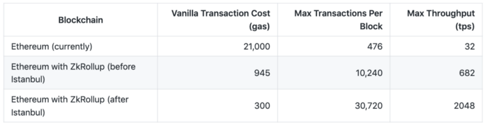
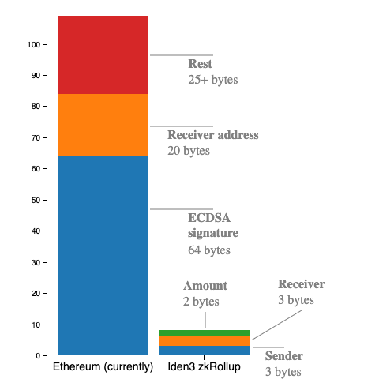

# Overview

## What is a zk-rollup?

In a nutshell, a zk-rollup is a layer 2 construction — similar to Plasma — which uses the Ethereum blockchain for data storage instead of computation. In other words, zk-rollups do computation off-chain and handle data availability on-chain.

All funds are held by a smart contract on the main-chain. For every batch, a zk-snark is generated off-chain and verified by this contract.

This snark proves the validity of every transaction in the batch.

This means that instead of relying on the Ethereum main-chain to verify each signature transaction, we just need to verify the snark to prove the validity of the off-chain transactions.

The beauty here is that this verification can be done in constant time. In other words, verification time doesn’t depend on the number of transactions! **This ability to verify proofs both efficiently and in constant time is at the heart of all zk-rollups.**

In addition to this, all transaction data is published cheaply on-chain, without signatures — under [calldata](https://ethereum.stackexchange.com/a/52992). Since the data is published on-chain, we get around the [data availability problems](https://github.com/ethereum/research/wiki/A-note-on-data-availability-and-erasure-coding) that have plagued other L2 solutions such as Plasma.

Importantly, anyone can reconstruct the current state and history from this on-chain data. This prevents censorship and avoids the centralization of coordinators (rollup block producers) — since anyone can build the state tree from scratch (and therefore become a coordinator).

## Why do we need zk-rollups?

Trust-minimised blockchain scaling mechanisms are sorely needed if blockchain applications are ever to achieve mass adoption.

For context, the Ethereum network can handle approximately 15 transactions per second (tps), while the Visa network averages around 2,000 tps.

As outlined in an earlier Iden3 [post](https://iden3.io/post/istanbul-zkrollup-ethereum-throughput-limits-analysis), zk-rollups have the potential to increase the Ethereum network’s maximum tps by two orders of magnitude, making it comparable to the Visa network’s average.

## How is 2000 tps possible?

In sum, zk-rollup uses [zk-snarks](https://docs.iden3.io/#/basics/key-concepts?id=zk-snarks) to scale Ethereum by taking advantage of the succinctness provided by snarks.

We improve blockchain scalability by compressing each transaction to ~10 bytes: instead of including signatures on-chain, we send a zk-snark which proves that 1000’s of signature verifications and other transaction validation checks have been correctly done off-chain.

Since signatures make up a large percentage of transaction costs (gas), in practice zk-rollup has the effect of significantly reducing the average cost per transaction. This allows us to fit more transactions per block, which results in a greater overall throughput.

> Bytes breakdown: vanilla Eth transaction (109+ bytes) vs zk-rollup transaction (8 bytes)
