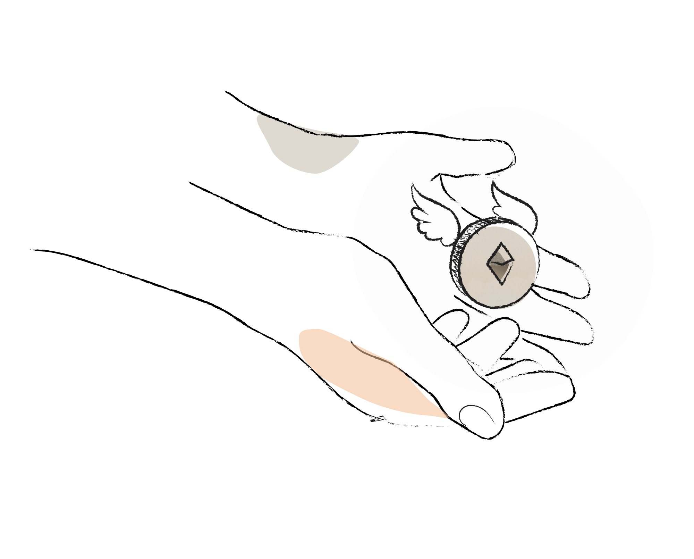

# Proof of donation

*How the next block creator is selected*

One of the most important things about hermez is the way it decides who the next block creator should be. We call this mechanism **proof-of-donation.**

We have an auction where everyone bids the amount of tokens they're willing to donate in order to obtain the right to create the next block.

The winning bid is the highest amount of tokens. And this address is assigned the right to create the next block.

We refer to this mechanism as **proof-of-donation** because a significant fraction of this bid goes back to be reinvested in the protocols and services that run on top of Ethereum.

Why is this important? We believe that scaling and sustainability go hand in hand. Innovations in scalability are a rare opportunity to realign incentives around the community and the public goods they provide. In a nutshell, if we can't figure out how to make blockchain infrastructure self-sustaining, then the question of how to scale them is irrelevant. To quote [Karl Floersch](https://ethresear.ch/t/mev-auction-auctioning-transaction-ordering-rights-as-a-solution-to-miner-extractable-value/6788):

> Designs like these are critical for framing the coming wave of Ethereum upgrades as not only innovations in scalability, but also as an opportunity to realign incentives to be pro-community, pro-commons, and pro-public goods. Without serious thought around how we will sustain blockchain technology we risk creating resilient decentralized architectures which eventually crumble due to massive economic centralization. This is not a future anyone wants to live in.

