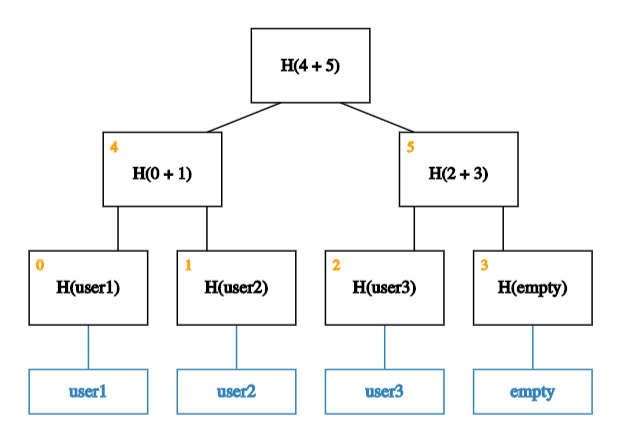
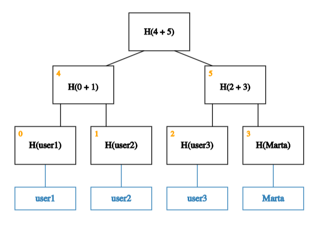
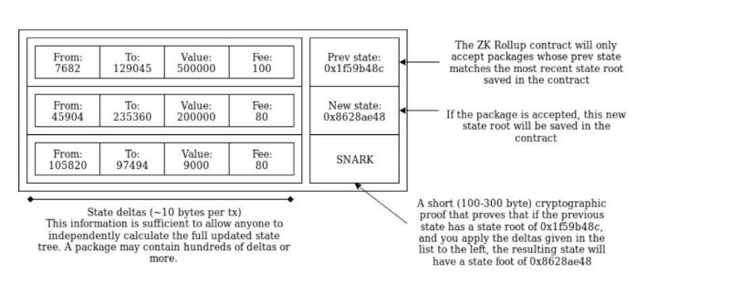

# Transaction flow

> Let’s go through the flow of a rollup transaction, starting with a user called Marta.

Marta is based in Madrid, and has one burning wish right now, to send some crypto-dollars (DAI) to her best friend, Jessica, living on the other side of the world in Argentina. While Jessica already has a Hermez account, it's Marta's first time.

1\. Marta creates a Hermez account by calling the `register` function of our on-chain Solidity contract (this links her Ethereum address to a zk-friendly BabyJubJub address).

2\. Since this is her first time sending DAI, she calls the contract’s on-chain `deposit` function specifying both the token (DAI) and the amount (100) she wishes to deposit.

3\. She’s now ready to send the transaction — containing Jessica’s address and the amount she wishes to send — off-chain to a rollup block producer (what we call a **coordinator**).

4\. Once the transaction is received, the coordinator applies the transaction locally, builds the new state tree, and computes the new state root (Merkle root).

> Note: in this flow, we’re assuming Jessica already has a hermez account (in the tree below we’ll refer to her as **user1**)

> **Old state tree**. The blue blocks are data blocks associated with users. H(user1) is the hash value of data block user1. H(0 + 1) is the hash of the concatenation of the blocks labelled 0 and 1. In other words, H(0 + 1) = H(H(user1) + H(user2))

> **New state tree**. The data block in the bottom right now stores Marta’s data. As a result, the hashes stored in blocks 3, 5, and root, have changed.

5\. The coordinator then submits an Ethereum transaction which contains the sender id (in this case Marta's Ethereum address), receiver id (Jessica's Ethereum address), the amount sent (these are the state deltas saved in callData), and the fee (a 4-bit field which allows the user to determine what % of the amount sent should go to the coordinator), as well as the old state root, the new state root, and a short cryptographic proof (zk-SNARK) that the new state root is correct.

6\. Once this transaction has been submitted, the proof is verified on-chain. This verification ensures that the state transition is correct. Once it has taken place, coordinators are able to reconstruct the latest state (aka Merkle tree).

And voila! It’s as simple as that.

**A note on withdrawals**

Jessica can withdraw the 100 DAI she’s received from Marta at any time. To withdraw her tokens, she can send a transaction (off-chain) to a coordinator signaling her intent to withdraw.

And then withdraw on-chain once the coordinator has calculated the new state root and sent it to the on-chain contract.

From Marta and Jessica’s point of view, this process is very similar to how they transact on Ethereum today. The difference being that this scales to millions of Martas and Jessicas :)

