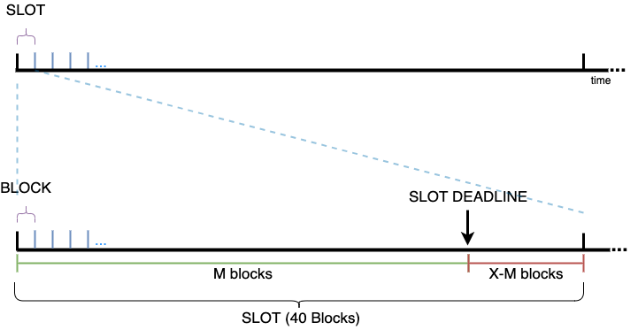
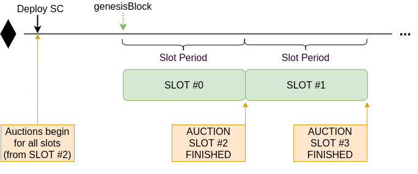

# Forging
Forging is the mechanism by which an authorized coordinator processes a batch of transactions and produces a zk-SNARK attesting to the correctness of the operation.
During a `ForgeBatch` call in the rollup smart contract, the consensus smart contract is invoked to validate if the coordinator is allowed to forge, to update the consensus state and to perform necessary consensus actions.

## Ensuring L1 User Transactions are Processed
If the coordinator is granted permission to a forge a batch, then the coordinator adds the selected transactions and generates a zk_SNARK proof.

There are 2 kind of batches:
- **L2-batch**: Forge only L2 transactions. (Neither the users' or the coordinator's L1 transactions are mined).
- **L1-L2-batch**: Forge both L1 and L2 transactions. The coordinator must forge all pending L1 user transactions. Optionally the coordinator may include L1-coordinator-transactions.

In order to force the coordinator to forge L1 transactions, the smart contract establishes a deadline for the L1-L2-batches. Every L1-L2-batches forged resets this deadline. This mechanism is summarized in the diagram below.

## Consensus
Hermez reaches a consensus on who will play the role of coordinator by running and auction. This auction is held for every slot among the existing coordinators. Bidding allows to select a single coordinator responsible to forge batches during the auctioned slot, thus incentivising coordinator efficieny, decentralization and maintaining the network running at all times.

## Batches, Slots and Blocks
Hermez zkRollup is divided into slots of a certain duration:
  - Block ethereum = ~ 15s
  - Slot = 40 Ethereum Blocks = 40 \* 15s = 600s = 10 min
  - [Slot deadline](#free-coordinator-override) = Defines the amount of time that any coordinator must wait to start forging without bidding, provided that the coordinator that won the current slot action hasn't forged anything during that time.

## Auction
Auction bids are placed only in [`HEZ`](../introduction/glossary?id=hez). The auction of future slots opens up to **1 month** (system parameter) in advance. Auction closes **2 slots** (system parameter) before the beginning the slot.

Bids placed during the auction should be at least greater than the minimal bidding price if it's the first bid in a slot, or 10% higher than the previous bid. Both the minimum bidding price and the premium factor of future slots can be modified by the network governance. Bids not meeting these conditions will not be valid and bidders will receive their HEZ when the slot is forged.

Auction is structured in groups of **6 slots** (i.e, slots are sequentially indexed 0,1,2,3,4,5,0,1,...), with **10 HEZ** as initial minimun bidding price for all the slots. Each slot index has an independent minimum bidding price.The governance can change this grouping value or minimum bidding price independently at any time and **affecting open auctions**. 

When the minimum bidding price is set to **0 HEZ value** for a given slot index, the value will be locked and governance will not be able to modify it anymore for that slot. 

## Allocation of Bids
All bids are deposited in the consensus smart contract the moment they are placed. 

Once the slot is forged, the tokens bid are assigned to **three** different accounts:
- Part will be **burnt** using the ERC-777 Burn function. 
- Part will be assigned to the **donations account**. Governance will decide how to allocate this funds into different projects.
- Remaining tokens will be allocated to an **incentives account**, compensationg active engagement and network adoption.

## Boot Coordinator
Boot coordinator acts as the last resort coordinator and its mission is to guarantee that there is a coordinator available. When governance considers that Hermez network is mature and has gained enough traction, it will open the possibility of disabling it.

## Coordinator Override
When the coordinator of the current slot doesn't forge any batch in the N first available blocks inside the slot, any available coordinator may forge batches without bidding. 

This mechanism ensures that Hermez network will always be running, and protects against potential technical problems or attacks. Additionally, this mechanism together with L1-L2 transaction deadline enforced during forging guarantees users that all funds will be recoverable from the L2 network. 

