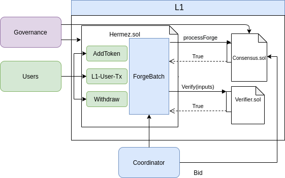

# Overview

Hermez is a zk-rollup solution that allows scaling payments and token transfers on top of the Ethereum public blockchain. It uses Ethereum for data storage but not for computation. In addition, by using zero-knowledge proofs, it includes an easily verifiable on-chain proof that off-chain computations have been carried out correctly.
All accounts and balances in Hermez are stored off-chain in a [`state tree`](https://hermez.gitbook.io/tempdoc/#/introduction/glossary?id=state-tree). Incoming [`user transactions`]((https://hermez.gitbook.io/tempdoc/#/introduction/glossary?id=transactions) are [`batched`]((https://hermez.gitbook.io/tempdoc/#/introduction/glossary?id=batch)) together, and through a [`zk-SNARK`](https://hermez.gitbook.io/tempdoc/#/introduction/glossary?id=zk-snark) that proofs that those `transactions` meet certain rules specified in a smart contract, the `state tree` transitions to a new valid state. The [`coordinator`]((https://hermez.gitbook.io/tempdoc/#/introduction/glossary?id=coordinator) is the entity that collects and codifies these `transactions`, calculates the `zk-SNARK` proof and submits the result to the smart contract that validates the transition. All `transactions` are made public to provide [`data-availability`]((https://hermez.gitbook.io/tempdoc/#/introduction/glossary?id=data-availability) to the protocol so that anyone can rebuild the `state tree` from on-chain data.
The [`governance`](https://hermez.gitbook.io/tempdoc/#/introduction/glossary?id=zk-snark) is the  entity that oversees the sustainability and evolution of the network. Some functions delegated to the governance include the upgrade of smart contracts, the modification of `system parameters`, or the execution of the `withdrawal protection mechanism` among others.
The overall picture can be seen in the diagram below.

Hermez functionalities can be summarized in:
- Handling [`L1-user transactions`]((https://hermez.gitbook.io/tempdoc/#/introduction/glossary?id=l1-user-transaction)
- [`Forging`](https://hermez.gitbook.io/tempdoc/#/introduction/glossary?id=forging) `batches`:
    - Ask [`consensus algorithm`](https://hermez.gitbook.io/tempdoc/#/introduction/glossary?id=consensus) to select a `coordinator` 
    - Add [`L1 coordinator transactions`](https://hermez.gitbook.io/tempdoc/#/introduction/glossary?id=state-tree)
    - Ensure that state transitions are valid via a `zk-SNARK`
    - Update [`state root`]((https://hermez.gitbook.io/tempdoc/#/introduction/glossary?id=state-tree)) and set [`exit root`]((https://hermez.gitbook.io/tempdoc/#/introduction/glossary?id=exit-tree)
- Facilitating some utility actions such as withdrawal of funds or adding new tokens to the rollup.

