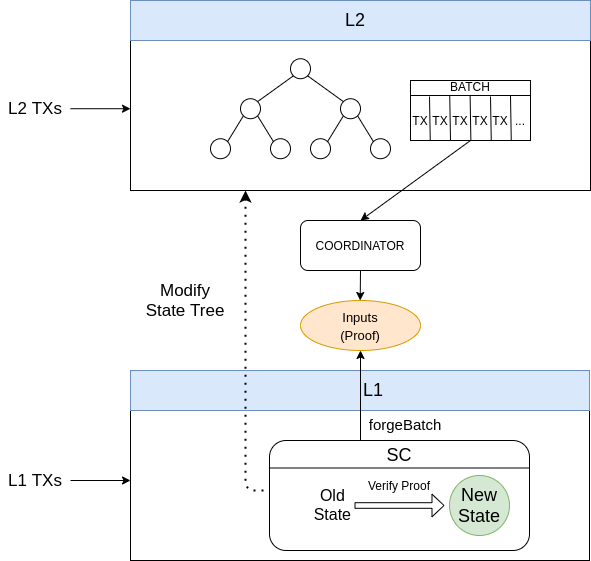

# Overview
## Summary

Hermez is a [`zk-rollup`](../introduction/glossary?id=zk-rollup) solution that allows scaling payments and token transfers on top of the Ethereum public blockchain. It uses Ethereum for data storage but not for computation. In addition, by using zero-knowledge proofs, it is easy to verify on-chain that computations have been carried out correctly.

All accounts and balances in Hermez are stored off-chain in a [`state tree`](../introduction/glossary?id=state-tree). Incoming [`transactions`](../introduction/glossary?id=transactions) are [`batched`](../introduction/glossary?id=batch) together, and through a [`zk-SNARK`](../introduction/glossary?id=zk-snark) that proofs that those transactions meet certain rules specified in a smart contract, the state tree transitions to a new verifiable valid state.  The [`coordinator`](../introduction/glossary?id=coordinator) is the entity that collects and codifies these transactions, calculates the zk-SNARK proof and submits the result to the smart contract that validates the transition. Transactions are made public to provide [`data availability`](../introduction/glossary?id=data-availability) to the protocol so that anyone can rebuild the state tree from on-chain data.

The [`governance`](../introduction/glossary?id=governance) is the  entity that oversees the sustainability and evolution of the network. Some functions delegated to the governance include the upgrade of smart contracts, the modification of [`system parameters`](../introduction/glossary?id=system-parameters), or the execution of the [`withdrawal protection`](../protocol/utility?id=withdrawal) mechanism among others.

The overall picture can be seen in the diagram below.

Hermez functionalities can be summarized in 3 major groups:
1. Handling L1-user transactions
2. [`Forging`](../introduction/glossary?id=forging) batches:
    - Ask [`consensus algorithm`](../introduction/glossary?id=consensus) to select a coordinator
    - Add L1 coordinator transactions
    - Ensure that state transitions are valid via a zk-SNARK
    - Update state and exit roots
3. Facilitating some utility actions such as withdrawal of funds or adding new tokens to the rollup.

[zk-rollup]:../introduction/glossary?id=zk-rollup
