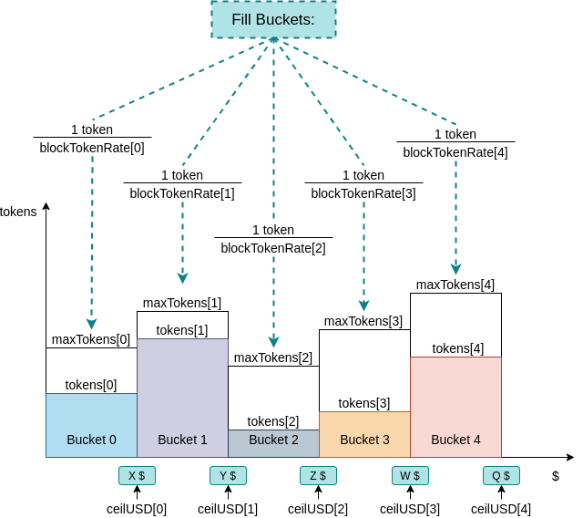

# Utility Functions
Utility functions include addititional functionalities provided by the Hermez network.

## Add New Tokens
Hermez contains a list with all tokens supported. The following list includes some requirements on the token lising:
- Tokens must be ERC20/ERC777.
- Only the governance can add new tokens.
- There can be up to 2^{32} different tokens
- Contracts maintain a list of all tokens registered in the rollup and each token needs to be listed before using it.
- There cannot be two tokens with the same ethereum address

## Withdrawal
Funds are held on Hermez smart contract after the user has performed an exit transaction. Withdrawal is the transaction to get these funds from smart contract to the ethereum address. It is done by proving the existence of a leaf in the exit tree. 

There is a limit on the amount that can be withdrawn at once as a prevention mechanism against trying to withdraw stolen funds. 

### Hermez Withdrawal Limit
For every user, withdrawals will be classified in one of several buckets depending on the USD amount to be withdrawn. Every bucket contains some credit indicating the maximum amount that can be withdrawn at any point in time. Buckets are re-filled with credits at a specifc rate (depending on bucket). When a user attempts to withdraw funds credits in the selected bucker are substracted. It the withdrawal amount exceeds the existing credits, the instant withdrawal cannot be performed.

### Withdrawal Resolution
The amount above the `withdrawal limit` set by the available credits wont be withdrawn instantly. In this case, tokens will be sent to the `WithdrawalDelayer` smart contract. Funds in this smart contract will be available after a time `D` during which Hermez governance can decide if there has been an attack. The two scenarios are:

- When governance decides that no attack has taken place or governance doesn't decide before a given time period, funds will be available for the user as soon as enough credits are available in the selected bucket.
- When governance decides that an attack has taken place, all the credits in all buckets will be set to 0, and all available funds in the account will be sent to the `WithdrawalDelayer' smart contract. These funds will be locked in the smart contract until the governance changes the bucket credits.

