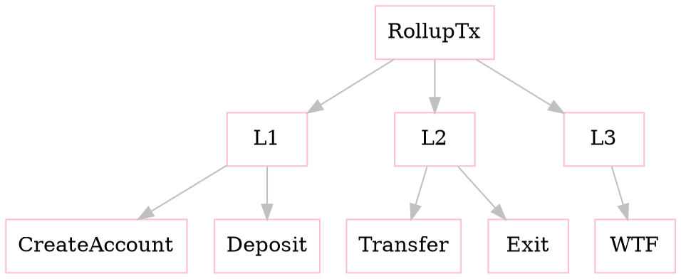
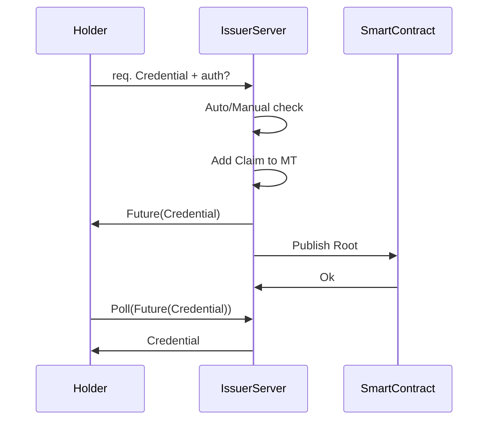

# Name of the module
*Description of the module [...].*

> - Take in mind that:
>     - the [idocs](https://idocs.hermez.io) adds enumeration on the titles, starting from the titles of 2nd level (`##`).
>     - in [idocs](https://idocs.hermez.io) 

## Title 1
### SubTitle 1.1
- `concept`: for referencing code variables, types, function names, file names, etc.
- *vitalik*: for making emphasis
- **bold**: only for very important things, such as warning, notes, etc


#### Using *graphviz*
You can use *graphviz* diagrams, which will be rendered in the [idocs](https://idocs.hermez.io):


#### Using *mermaid*

[Mermaid docs](https://mermaid-js.github.io/mermaid/#/)



#### Using *drawio*
You also can use https://draw.io to make diagrams.
If you use this option, when exporting the `*.png` file, make sure that the checkbox of *'Include a copy of my diagram'* is checked. And store the picture in the same directory where lives the markdown file that uses the image, in order to edit the diagram in the future.


### Lists
- When doing a list of items,
- it's important to don't leave space between items,
    - because if there is a space,
    - the markdown puts too much space
- between all the items

## Title 2
### SubTitle 2.1
Adding an img:
```

```

How to add an img with different size:
```

```

## Lib methods
As we are using *Go* as language, we define the structs and methods directly with Go, so the *types* and the *parameters* are well specified.
The idea of this, is that a person who needs to integrate another module with this one, will be able to know all the interfice details directly from the spec, without needing to wait until the module is coded.

### Structs
```go
// Tx contains all the parameters from a transaction
type Tx struct {
    From common.Address
    To common.Address
    TAmount uint64
    
    Amount uint64
    Data struct {
        Title string
        Content []byte
    }
}
```

### Methods
```go
// NewTx returns a new tx object
func NewTx(from, to common.Address, amount uint64) (*Tx, error)

// Bytes returns the *Tx parsed in an array of bytes following the codification order
func (tx *Tx) Bytes() []byte

// UpdateAmount description [...]
func (tx *Tx) UpdateAmount(amount uint64) error

// Sign performs the signature of a *Tx by an *Account private key [...]
func (account *Account) Sign(tx *Tx) error

// SwapEndianness [...]
func SwapEndianness(b []byte) []byte
```
